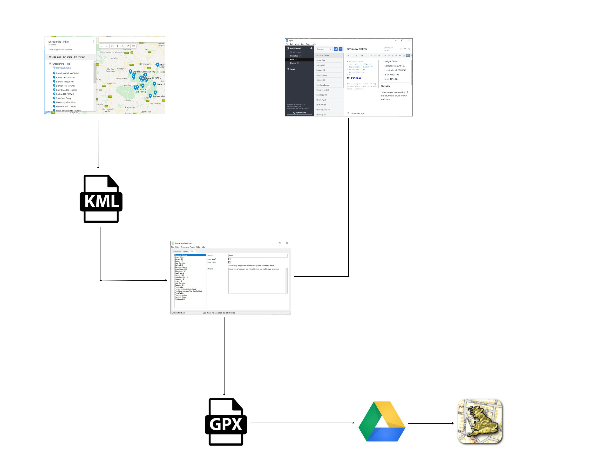

# Hills
{: .mt-4}

A database of the hills in Shropshire is maintained.

Information is maintained in two places:

- Trello - used to hold textual information about each Hill
- Google Maps - used to hold the location of each Hill

It is essential that the name of the Hill is identical in both Trello and Google Maps as this is what is used to draw the information together.

The information is consolidated using an AutoHotKey application, from this application a GPX file containing the consolidated information can be generated which can then be loaded into the UK Map app on the iOS devices.

The structure of the database is shown below:

