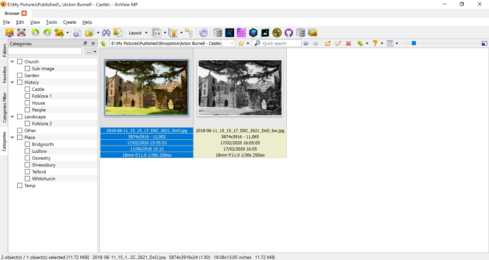
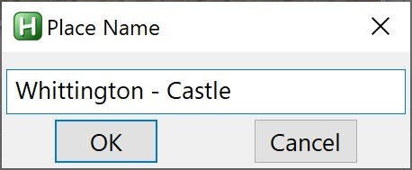
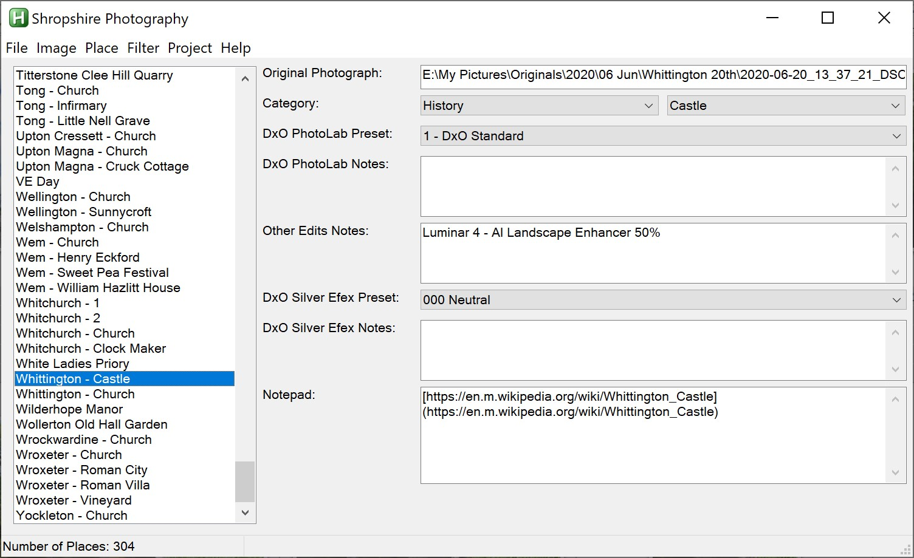
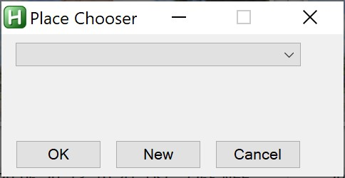
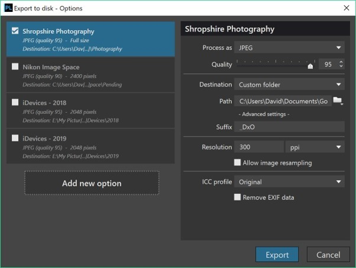
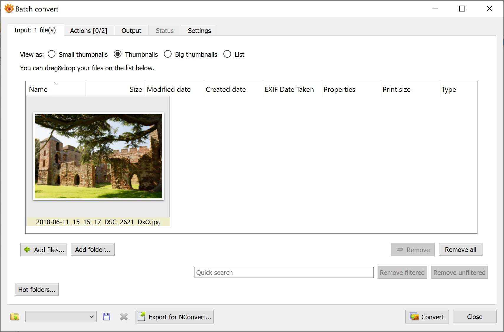
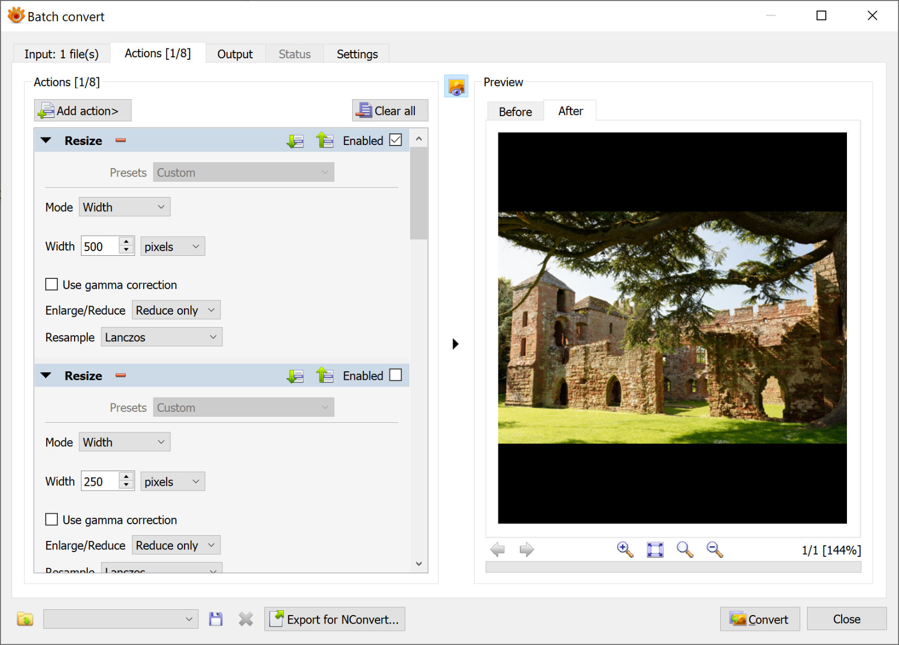
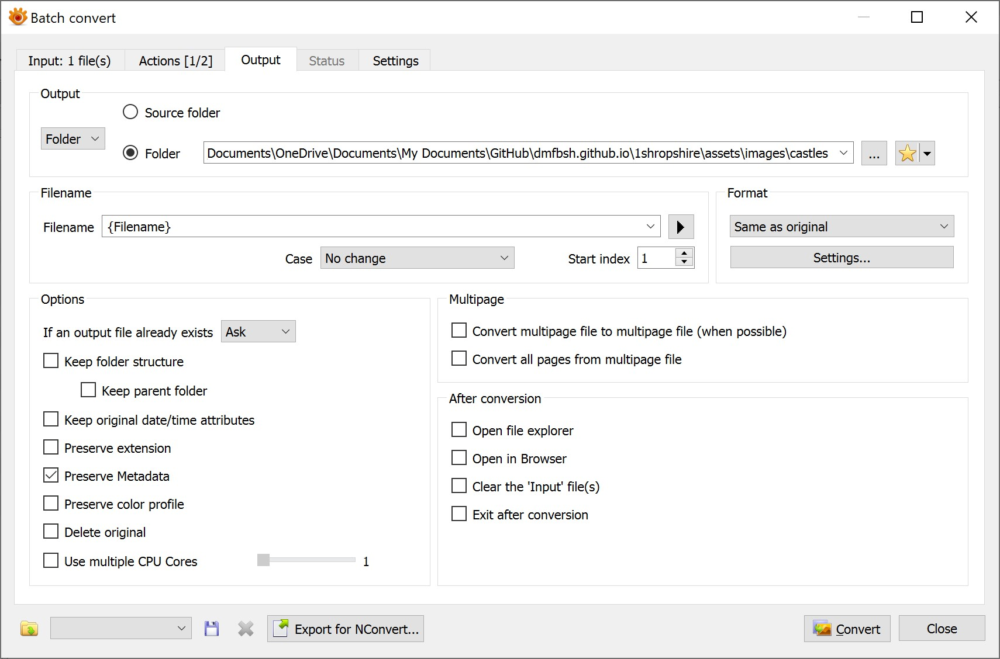
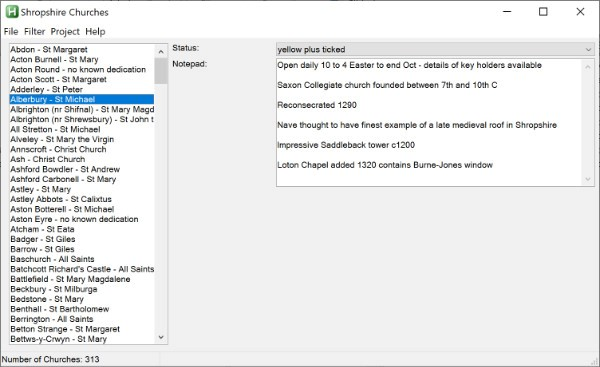

# Add New Item
{: .mt-4}

The procedure to add a new item to the web site is as follows:

1. In XnViewMP select a photo for the item, this is from the ‘Originals’ folder of the photo collection – there is a favorite set up to allow easy access to the ‘Originals’ folder

    

2. Create a new record for the item in the AHK Shropshire Photography application, this will also create a folder in the directory:

    >`E:\My Pictures\Published\Shropshire`

    There are multiple ways to do this:

    - Select the original image in XnViewMP and launch the AHK Shropshire Photography application from the toolbar, this will prompt for a place name, select ‘New’ to create a new place

    

    

    

    - Create the record in the AHK Shropshire Photography application (using File > New), and then select the original image in XnViewMP and launch the AHK Shropshire Photography application from the toolbar, this will prompt for a place name, select the place name from the dropdown list

    

    - Create the record in the AHK Shropshire Photography application (using File > New), and then select the original image in the AHK Shropshire Photography application (using Image > Select)

3. In DxO PhotoLab develop the photo and export to disk using the Shropshire Photography output option

    

4. In the AHK Shropshire Photography application record any adjustments made in DxO PhotoLab

5. Move the developed photo to the item's folder - use the Move function in the AHK Shropshire Photography application to do this

6. Edit photo as required with Affinity Photo and / or Luminar and / or Landscape Pro

7. In the AHK Shropshire Photography application record any adjustments made in the photo editor(s)

8. Generate a thumbnail for each category to which the item is assigned to - for the history page the thumbnails are 400x400 and for all other pages the thumbnails are 500x500 - thumbnails are generated using an XnViewMP batch convert task:

    - Select the image

    - Select the action (two are defined)

    - Select the output folder (defined as favorites)

    

    

    

9. Add the item to the MD file for the page(s) on which it will feature – use the function in the AHK Shropshire Database application to generate a template (this will insert the correct filename for the photo)

10. Record the changes made to the Web Site in the updates log (markdown file)

## Additional Steps If  The Item Is A Church

1. Change the colour on Google map

    >[Google Maps](https://www.google.co.uk/maps/d/)

2. Change the status in the AHK Shropshire Churches application (this will automatically update the status (i.e. list) in Trello)

    

3. Use the AHK Shropshire Churches application to generate a new GPX file (for the UK Map app) – the GPX file should then be transferred to the iOS devices and loaded into the UK Map app

## Additional Steps If The Church Has Sub-Items

1. In XnViewMP identify any photos for the sub-images and assign the selected photos to the Church > Sub-Image category

2. In DxO PhotoLab develop the photos for the sub-images and export to disk using the Shropshire Photography output option

3. Add the filenames of the sub-images to the MD file entry for the church

4. Crop and resize the sub-images to be 240px high and save in the assets\images/churches-sub folder, open the photo in XnViewMP to crop it (if required), the resizing is done using an XnViewMP batch convert task, the original DxO files can then be deleted

# Update Photo

Sometimes it may be desirable to update the photo for an item, following this procedure:

1. Delete the photo(s) of the item in the item's folder in:

    >`E:\My Pictures\Published\Shropshire`

2. Delete the published versions of the photo from the appropriate folder(s) in:

    >`C:\Users\David\Documents\OneDrive\Documents\My Documents\GitHub\dmfbsh.github.io\1shropshire\assets\images`

3. Process the new photo as steps 1 to 10 above (but at step 2 just select the new original photo)
