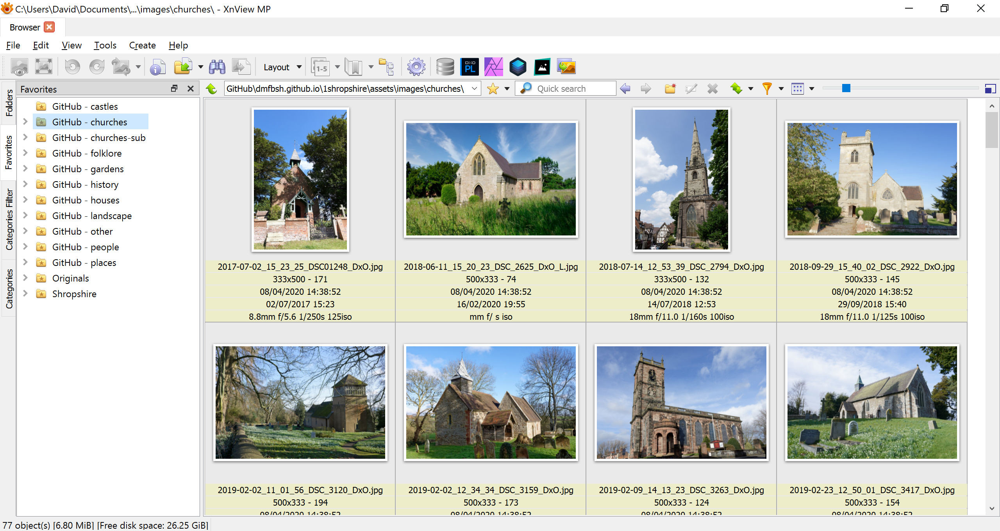
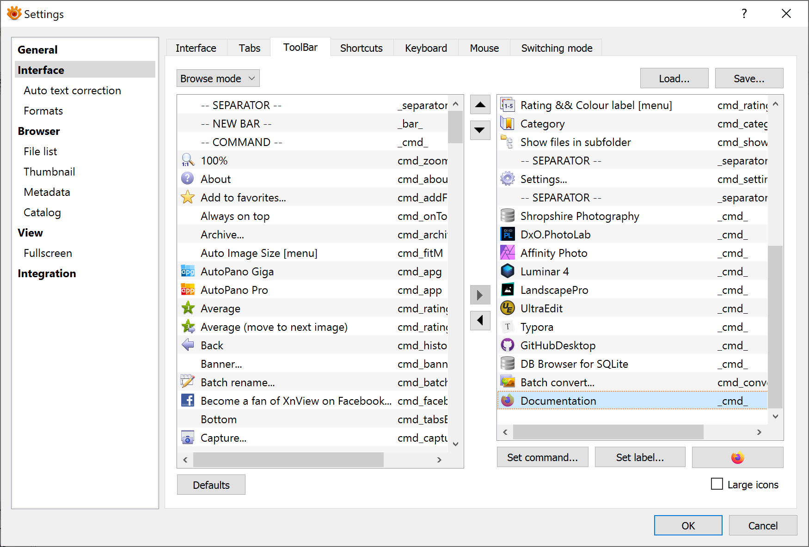
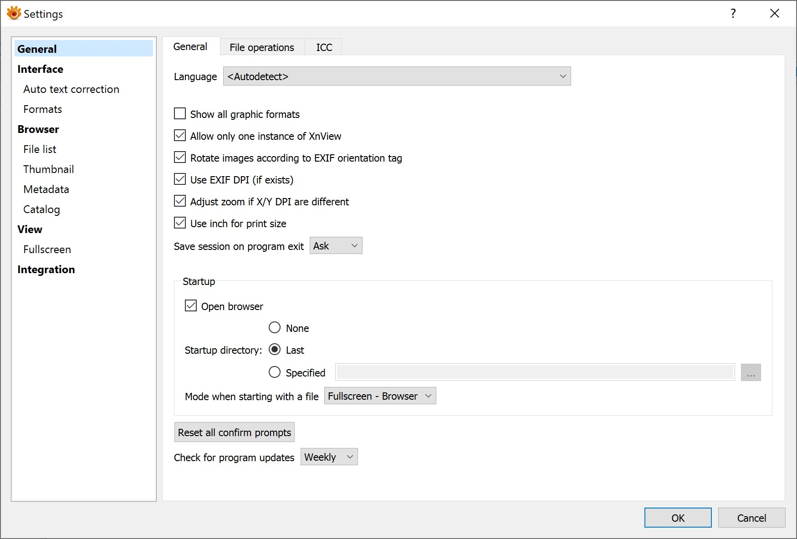
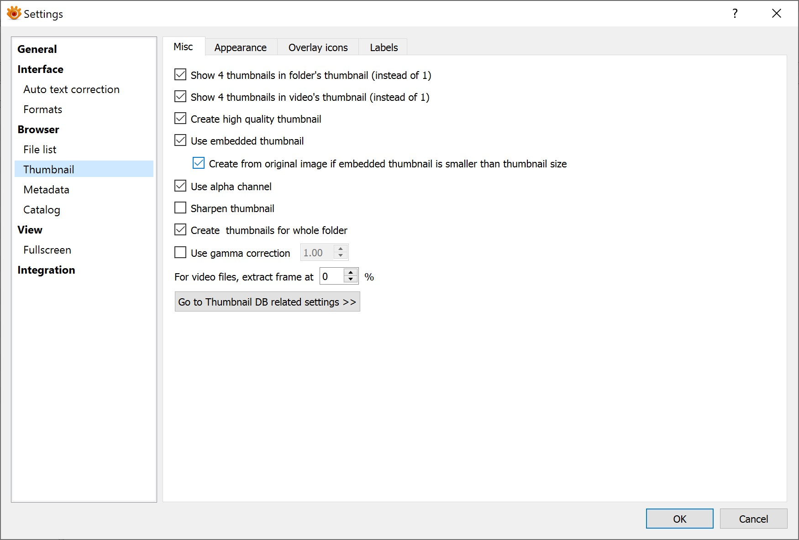
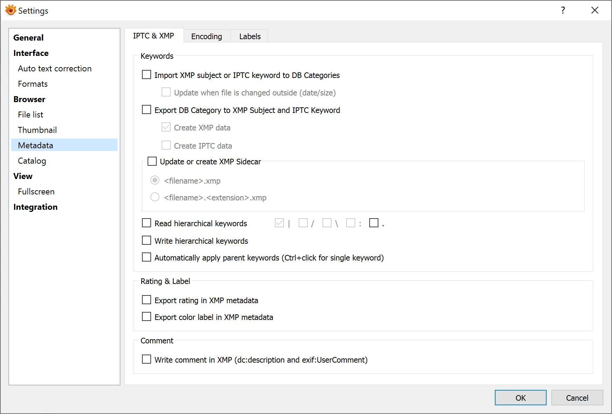
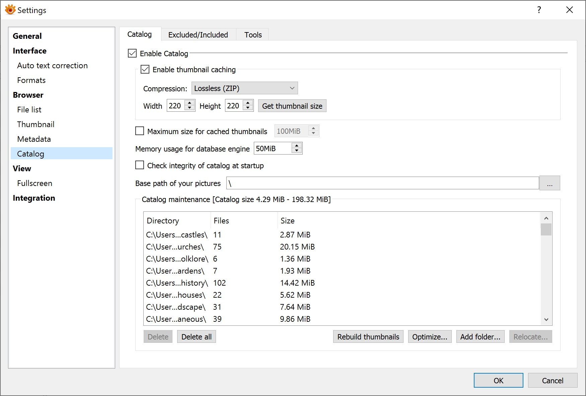
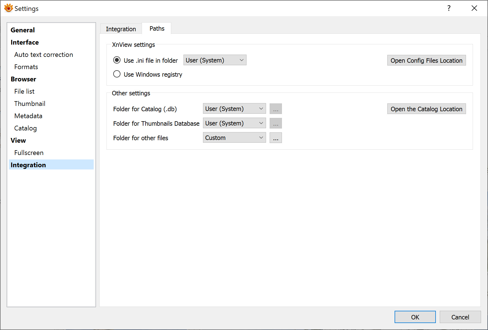
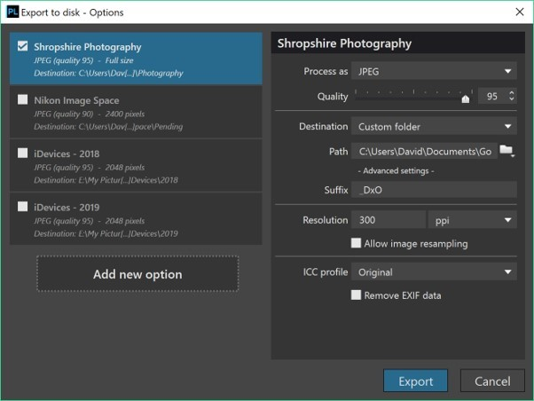

# Tools
{: .mt-4}

The following tools are used by the project:

- MS Windows 10
  - Development Tools
    - Ruby
    - Jekyll
    - Visual Studio Code
    - Typora
    - AutoHotKey
    - Git
    - DB Browser (SQLite)
  - Photo Editors
    - XnViewMP
    - DxO PhotoLab
    - DxO Nik Silver Efex Pro
    - Affinity Photo
    - Luminar 4
    - Landscape Pro
- iOS
  - Working Copy (GitHub client)
  - UK Map
  - Trello

## Installation and Configuration

### Ruby

To install Ruby, do the following:

1. Download and install Ruby with Devkit from: https://rubyinstaller.org/downloads/
2. Run the ***ridk install*** command (step on the last stage of the installation wizard)

### Jekyll

To install Jekyll, do the following:

1. Install the Ruby gems: ***gem install jekyll bundler***
2. Check the version: ***jekyll -v***

### Visual Studio Code

Install the following:

1. Git

Install the following extensions:

1. AutoHotKey Plus
2. Code Runner
3. Hex Editor
4. Open in External App
5. Power Tools
6. Ruby
7. SQLite
8. VSCode Ruby

### Typora

Typora is installed with no additional configuration.

### AutoHotKey

AutoHotKey is installed with no additional configuration.

Note that the 64-bit version must be installed.

### Git

Git is installed with no additional configuration.

### DB Browser (SQLite)

DB Browser (SQLite) is installed with no additional configuration.

### XnViewMP

1. Set up the favourites folders as shown below:

    

3. Configure the toolbar as shown below:

    

4. Change various settings are shown below:

    Allow only one instance of XnView

    Use embedded thumbnail

    Create from original image if embedded thumbnail is smaller than thumbnail size

    Overlay icons

    Import XMP subject or IPTC keyword to DB Categories

    Read hierarchical keywords

    Enable thumbnail caching

    Paths (the other files are located in the GitHub repository)

    

    

    

    

    

    

### DxO PhotoLab

Create an export to disk option:

### DxO Nik Sliver Efex Pro

No specific configuration needed.

### Affinity Photo

No specific configuration needed.

### Luminar 4

No specific configuration needed.

### Landscape Pro

No specific configuration needed.
