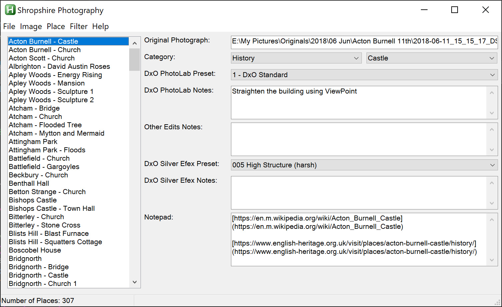

# Project
{: .mt-4}

The status of the project is managed in an SQLite database which is accessed via an AutoHotKey application.

To access SQLite, the AutoHotKey script requires the following:

1. The SQLite3.dll - note that as the 64-bit version of AutoHotKey is installed, the 64-bit version of the SQLite3.dll must be used
2. The AutoHotKey class wrapper for SQLite, this can be downloaded from: https://github.com/AHK-just-me/Class_SQLiteDB

The application is shown below:

The application is configured using a .ini file located in the same folder as the application.