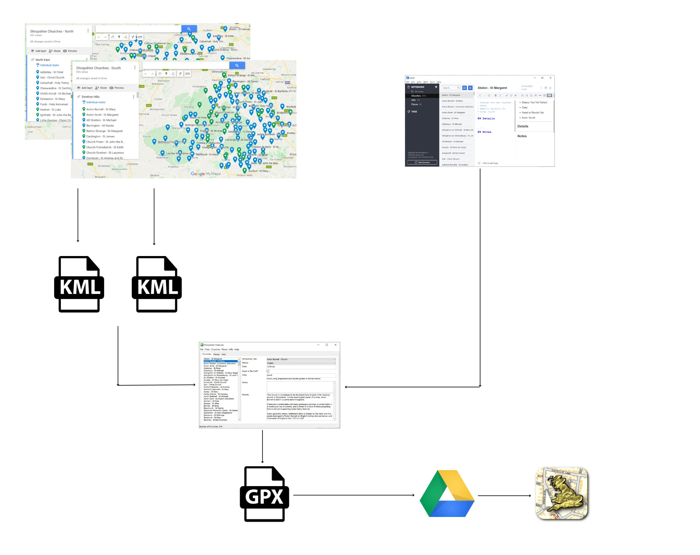

# Churches
{: .mt-4}

An SQLite database of the Churches in Shropshire is maintained.

Source information is maintained in two places:

- Trello - used to hold textual information about each Church
- Google Maps - used to hold the location of each Church

It is essential that the name of the Church is identical in both Trello and Google Maps as this is what is used to draw the information together.

The information is consolidated using an AutoHotKey application, from this application a GPX file containing the consolidated information can be generated which can then be loaded into the UK Map app on the iOS devices.

The structure of the database is shown below:

## Google Maps

Due to the number of Churches, there are two Google Maps - North and South.  Any changes to the location of a Church must be made in Google Maps.  Data is then exported from Google Maps as two KML files, the KML files are stored in the folder:

`C:\Users\David\Documents\OneDrive\Documents\My Documents\GitHub\dmfbsh.github.io\_maps`

The KML files can then be imported into the SQLite database, using a function in the AutoHotKey application.

## Trello

Trello is used to hold any notes / textual information about the Churches.  Also, there are four lists so that the 'visited' status can be maintained, the lists are:

- Church - Pending Visit (blue plus)
- Church - Planned to Visit (yellow plus)
- Church - Planned to Visit - Priority (yellow plus ticked)
- Church - Visited (green plus)

Updates / edits to the 'visited' status and / or the notes can be made in either Trello or the AutoHotKey application.  In the AutoHotKey application, there is a function 'reload' to refresh any changes made in Trello to the SQLite database for the currently selected item.  Alternatively, when the currently selected item is saved in the AutoHotKey application, the changes are pushed to Trello.

To ensure that Trello and the SQLite database are kept aligned, there is a function in the AutoHotKey application to compare the two and report any differences, so that they can be corrected.