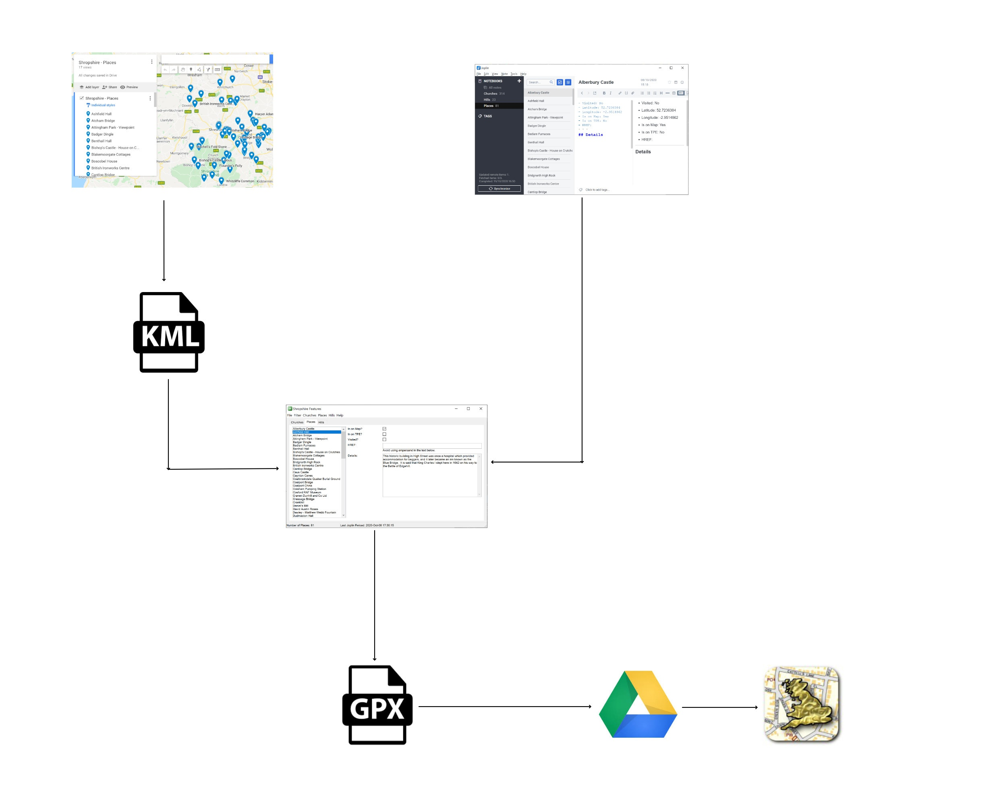

# Features
{: .mt-4}

An SQLite database of Shropshire 'Features' is maintained, Features are: Churches, Hills and Places.

The SQLite database is actually the same SQLite database as is used for the Shropshire Photography project.

Location information for the Features is maintained in Google Maps, and other information is maintained in Joplin (to allow it to be changed on any device).

Information from Joplin and Google Maps is consolidated by an AutoHotKey application and can be exported as GPX files to be ingested into the UK Maps app on the iOS devices for viewing.

## Churches

Source information is maintained in two places:

- Joplin - used to hold textual information about each Church
- Google Maps - used to hold the location of each Church

It is essential that the name of the Church is identical in both Joplin and Google Maps as this is what is used to draw the information together.

The information is consolidated using an AutoHotKey application, from this application a GPX file containing the consolidated information can be generated which can then be loaded into the UK Map app on the iOS devices.

The information can be edited in either the AutoHotKey application or Joplin, as there is a two-way sync between these two databases.

The structure of the database is shown below:

### Google Maps

Due to the number of Churches, there are two Google Maps - North and South.  Any changes to the location of a Church must be made in Google Maps.  Data is then exported from Google Maps as two KML files, the KML files are stored in the folder:

`C:\Users\David\Documents\OneDrive\Documents\My Documents\GitHub\dmfbsh.github.io\_maps`

The KML files can then be imported into the SQLite database, using a function in the AutoHotKey application.

## Hills

Source information is maintained in two places:

- Joplin - used to hold textual information about each Hill
- Google Maps - used to hold the location of each Hill

It is essential that the name of the Hill is identical in both Joplin and Google Maps as this is what is used to draw the information together.

The information is consolidated using an AutoHotKey application, from this application a GPX file containing the consolidated information can be generated which can then be loaded into the UK Map app on the iOS devices.

The structure of the database is shown below:

To create a new Hill or edit an existing Hill:

1. Create / edit the Hill location as required in Google Maps

2. From Google Maps, save the entire map as a KML file and save to the location:

   `C:\Users\David\Documents\OneDrive\Documents\My Documents\GitHub\dmfbsh.github.io\_maps\Shropshire - Hills.kml`

3. Create / edit the Hill notes as required in Joplin

4. Using the AutoHotKey application import the Hill location details from the KML file

5. Using the AutoHotKey application import the Hill notes from Joplin

6. Using the AutoHotKey application generate the GPX file, this is saved to the Google Drive so that it is available on the iOS devices

7. Import the GPX file into the UK Map app

## Places

Source information is maintained in two places:

- Joplin - used to hold textual information about each Place
- Google Maps - used to hold the location of each Place

It is essential that the name of the Place is identical in both Joplin and Google Maps as this is what is used to draw the information together.

The information is consolidated using an AutoHotKey application, from this application a GPX file containing the consolidated information can be generated which can then be loaded into the UK Map app on the iOS devices.

The structure of the database is shown below:

To create a new Place or edit an existing Place:

1. Create / edit the Place location as required in Google Maps

2. From Google Maps, save the entire map as a KML file and save to the location:

   `C:\Users\David\Documents\OneDrive\Documents\My Documents\GitHub\dmfbsh.github.io\_maps\Shropshire - Places.kml`

3. Create / edit the Place notes as required in Joplin

4. Using the AutoHotKey application import the Place location details from the KML file

5. Using the AutoHotKey application import the Place notes from Joplin

6. Using the AutoHotKey application generate the GPX file, this is saved to the Google Drive so that it is available on the iOS devices

7. Import the GPX file into the UK Map app

## Joplin

Joplin is used to hold any notes / textual information about the Churches, Hills and Places.

The notes are in a structured format so that they can be parsed.

For the Churches there is a two-way exchange between Joplin and the AutoHotKey application.

For the Hills and Places there is a one-way bulk reload from Joplin to the AutoHotKey applucation.
