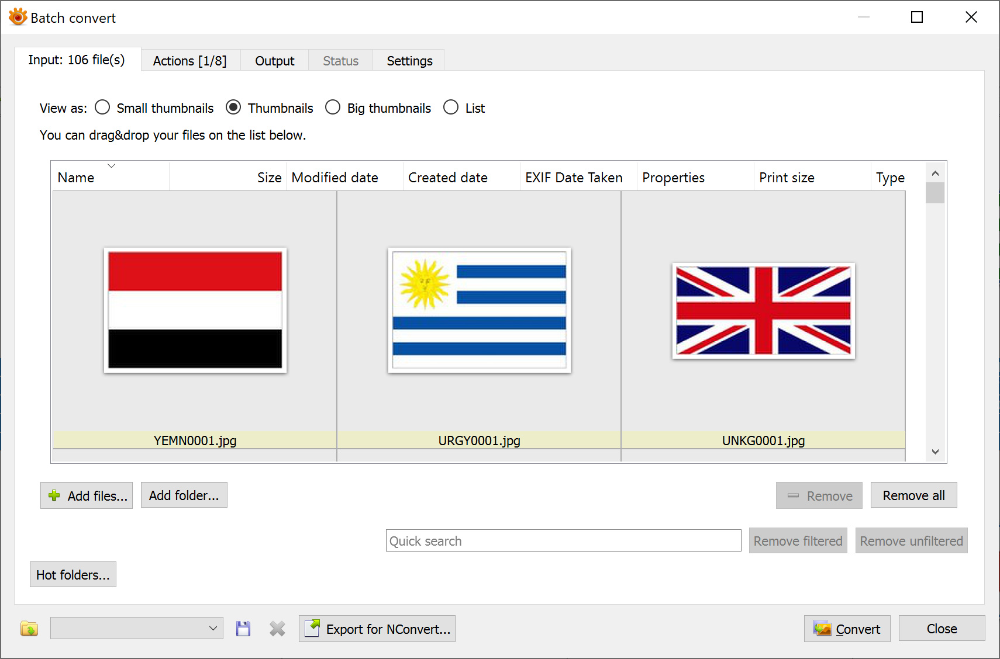
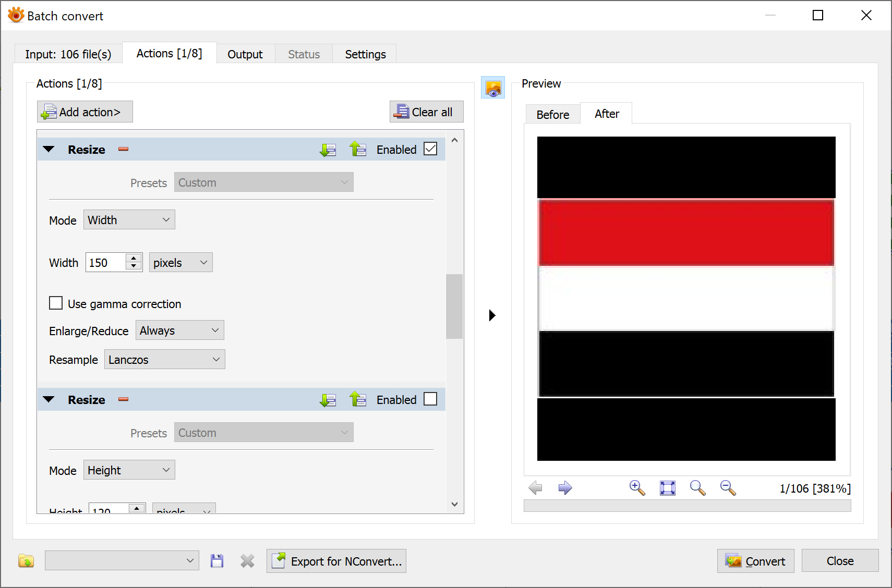
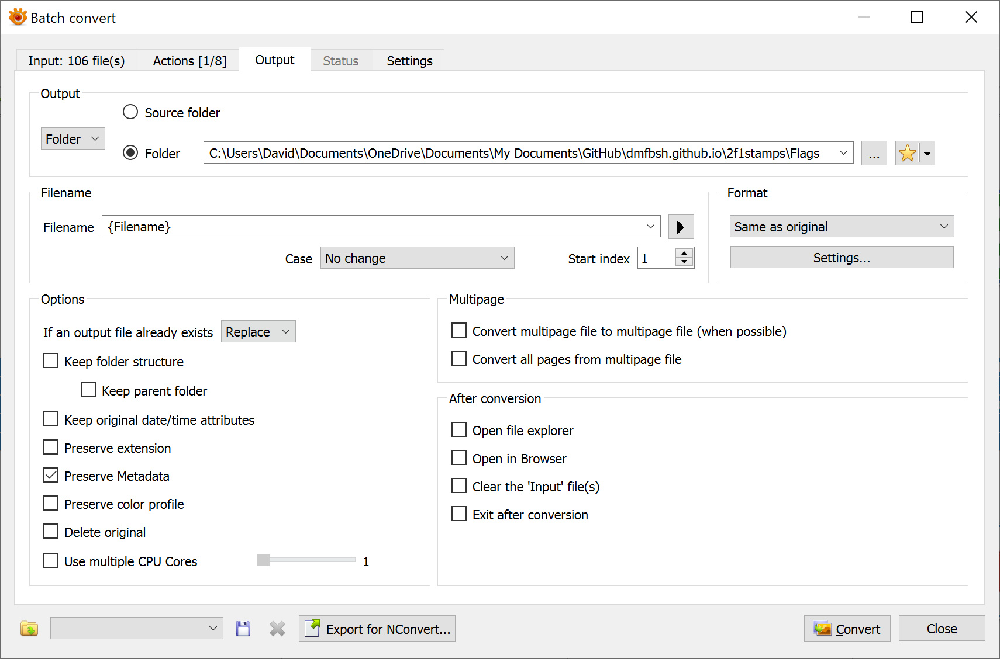
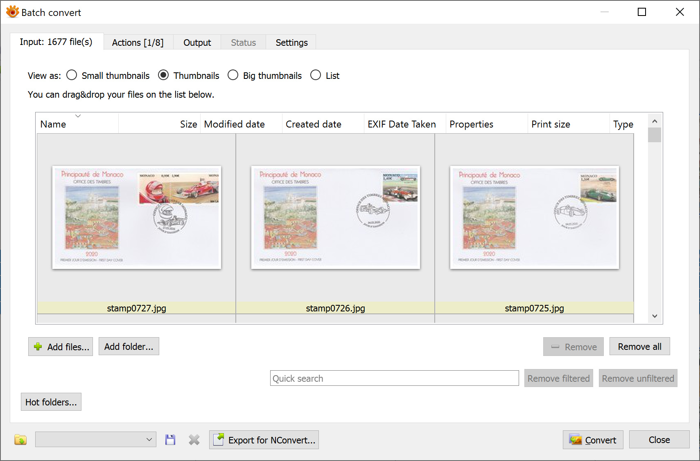
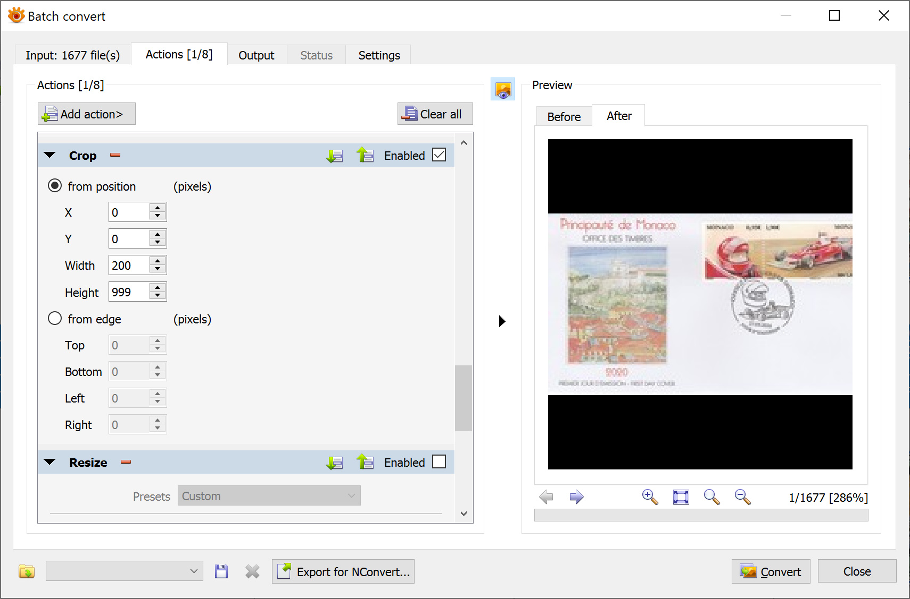
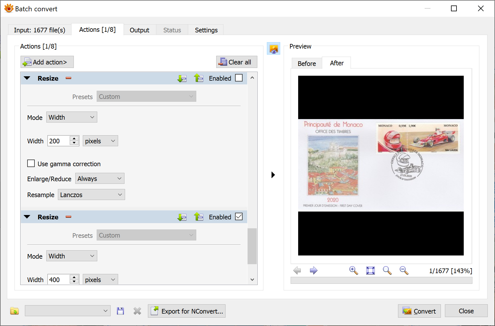

# Generate the Web Pages
{: .mt-4}

## Flags

The image files for the flags need to be copied to the web site - there is a function in the MS Access database to do this.

Once the files have been copied, the images are resized to have a maximum width of 150px.

Use the Batch Convert function in XnViewMP:

## Thumbnails

The image files for the thumbnails need to be copied to the web site - there is a function in the MS Access database to do this.

Once the files have been copied, the images are resized to have a maximum height of 120px.

Use the Batch Convert function in XnViewMP:

The thumbnails must also be cropped to have a maximum width of 200px.

Use the Batch Convert function in XnViewMP:

## Images

The image files for the main images need to be copied to the web site, the images are classified as either large or small (small is width is less than 1000px, large is width is 1000px or more).  There is a function in the MS Access database to do this - the large and small images are placed in separate folders.

Once the files have been copied, the images are resized to have a maximum width of 200px is small or 400px if large.

Use the Batch Convert function in XnViewMP:

The large and small images must then be copied to the parent folder to consolidate into one place.

Generate YML and HTML

The YML is generated from the MS Access database.

The HTML templates for the popups are generated from the MS Access database (because the popups are dynamic in nature).

The static HTML is then generated using Jekyll.

Additional Years and Decades

For each extra year covered by the web site, create a new 2-yearYYYY.html file

For each extra decade covered by the web site, create a new 2-yearsYYY0.html file

Sub-Images

Advanced Renamer is used to rename the car and driver sub-images.  Two batch methods are defined:

F1 Stamps - Cars

F1 Stamps - Drivers

ARen is set up an external editor in FastStone Image Viewer  - copy the master image, rename with ARen and crop with FastStone Image Viewer.
