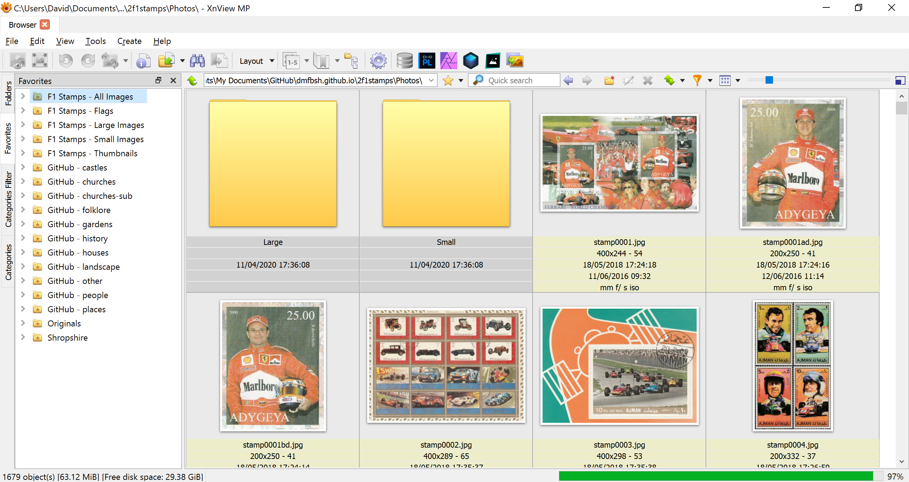
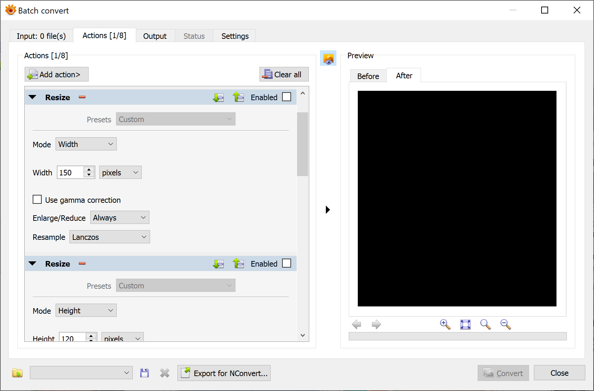

# Tools
{: .mt-4}

The following tools and applications are used:

- MS Windows 10
  - MS Access
  - Development Tools
    - Ruby
    - Jekyll
    - Visual Studio Code
    - Typora
    - Git
  - Photo Editors
    - XnViewMP

## Installation and Configuration

### Ruby

See the configuration for the Shropshire Web Site project.

### Jekyll

See the configuration for the Shropshire Web Site project.

### Visual Studio Code

See the configuration for the Shropshire Web Site project.

### Typora

See the configuration for the Shropshire Web Site project.

### Git

See the configuration for the Shropshire Web Site project.

### XnViewMP

Define the favourites as shown below:

Define the batch actions as shown below:

These are held in the configuration file:

- Actions for Web Sites.xbs
