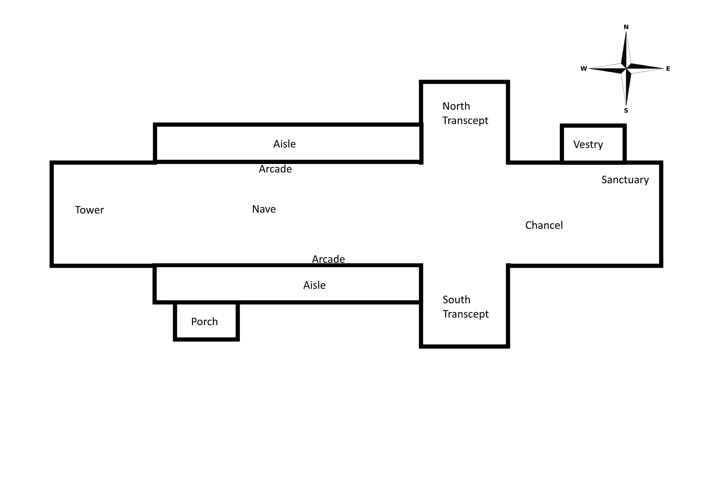

# Architectural Structure

## Introduction

The earliest Christians worshipped in private houses, often in secret. With the victory of the Roman emperor Constantine at the Battle of Milvian Bridge in 312 AD, Christianity became a lawful and then the privileged religion of the Roman Empire. With the religion lawful, Christian architecture was made to correspond to civic and imperial forms, and so the Basilica, a large rectangular meeting hall (with a nave and aisles and sometimes galleries and clerestories), became the model for churches. While civic basilicas had apses at either end, the Christian basilica usually had a single apse where the bishop and presbyters sat in a dais behind the altar. While pagan basilicas had as their focus a statue of the emperor, Christian basilicas focused on the Eucharist as the symbol of the eternal, loving and forgiving God. The first very large Christian churches, were built in Rome in the early 4th century.  Since then, the plan of a church has essentially remained the same.

## Direction

Churches are always oriented east to west with the chancel, sanctuary and altar in the east.  This is because the east faces towards the holy city of Jerusalem which is where, in medieval writing, God’s presence was said to be strongest.  It also links to the Christian story of Jesus rising from the dead at sunrise on Easter day.  The window in the east end of the building also lets in the rising sun symbolising God as the light of the world.  Although this would also serve the practical function of lighting up a dark church in medieval times when candles were less common and electricity didn’t exist.

The church at Ironbridge (St Luke) is an exception to this because the land at the west end would not support the tower.

## Shape

Churches are most often built in a cruciform shape (cross shaped).  The reasoning for this is simple – the cross represents the cross in Christian teachings.

## Tower

The church tower is the part of the church which dominates the landscape.  The tower is often situated at the west end of the nave.  In some churches the tower is situated in the centre above the crossing.  Church towers have many styles and designs, and some include spires.

The church tower has many functions, the primary purpose being to denote the location of the church.  Most towers contain bells which provide direct and audible communication between the church and the parish, church towers have other functions.  Some towers were built as lanterns to allow light into the body of the church, whereas others maintained a light to provide direction for night-time travel.  Saxon or Norman towers were also built as accommodation and refuge in times of unrest.  After the Norman Conquest numerous towers were built onto churches, these were often massive, like towers on contemporary castles, and where there is an absence of a west doorway this may indicate a defensive structure.

## Narthex

A narthex is either an outside, covered porch-like structure or an inside area separated from the nave by a screen, but over time this word has also come to mean "entry" or "foyer".  It is always at the West end of the church.  Traditionally the narthex was a part of the church building, but was not considered part of the church proper, as it is where those not eligible for admittance into the general congregation (particularly catechumens[^1] and penitents [^2]) could hear and partake of the service.

[^1]: A person who is receiving instruction in preparation for Christian baptism or confirmation.

[^2]: A person who repents their sins and seeks forgiveness from God.

## Porch

Ancient churches usually stand to the north of the original village, and so the south door is the main entrance. In the Middle Ages many ceremonies took place at the church door, including parts of the baptism and marriage services.  Schooling, penance, the churching of women and the coroners court also took place at the church door.  Typically, it was not until the 14th Century that porches were constructed to give shelter (usually at the south door).

Some of the finest medieval porches in Shropshire can be seen at Munslow and Billingsley.

## Baptistry

The baptistry is a separate, transitional space used by those who are not yet members of the church.  In most churches the baptistry is the area close the narthex where the font is located, at the west end of the nave.

## Nave

Derived from the Latin word 'navis', meaning ship.  It was thought that the nave roof resembled an upside down ship, or the Ark of Salvation. 

The nave is the main body of the church.  Originally, the nave was unconsecrated and its maintenance was the responsibility of the congregation.  In the early days of the church, the nave was used for many functions: it was the scene of trial by ordeal [^3], storage space for the arms which every parish had to provide (the regimental colours found in many churches are a reminder of this) and a venue for guild plays, processions, church ales [^4] and business.

Churches had a stone bench set into the side walls so that old and infirm people could sit down.  This is where the saying 'the weakest go to the wall' comes from.

Bench style seating was introduced into churches after the Reformation when the preaching of very long sermons became a major part of the services and people needed to be able to sit down.

[^3]: Trial by Ordeal - a judicial practice by which the guilt or innocence of the accused was determined by subjecting them to a painful, or at least an unpleasant, usually dangerous experience. In medieval Europe, it was considered a "judgement of God": a procedure based on the premise that God would help the innocent by performing a miracle on their behalf.

[^4]: Church Ales - a party or festivity in an English parish at which ale was the chief drink. It was typically a fundraising occasion for the parish that might include music and dancing. Very common in the later Middle Ages, parish ales encountered some opposition after the English Reformation, though some survived until modern times in some form.

## Arcade

An arcade is a range of arches supported on piers or columns.  The term is also used to describe the arched division between the nave of a church and its aisles.

## Aisle

The word aisle comes from the Latin 'ala' meaning wing.

An aisle is a sideways extension of a nave, from which it is divided by an arcade of arches.  Some churches were built with aisles, but they were usually added to earlier buildings, perhaps to accommodate the growing population.

## Clerestory

A clerestory is a high section of wall that contains windows above eye level.

In architecture, a clerestory, is a high section of wall that contains windows above eye level. The purpose is to admit light, fresh air, or both.

In larger churches, the upper level of the nave wall was often pierced by windows to increase the amount of light entering the church.  When aisles were added in medieval times, many churches raised the nave wall, so that a clerestory could be installed.

## Columns

Arcades rest on columns.

The first columns would have been made of wood. They are like trees and remind us of ancient pagan beliefs and practices.

Capitals, the top part of columns, are often carved with leaves or other similar decorations, reinforcing the connection with trees.

## Gallery

A gallery is an upper storey constructed to provide additional seating for the church.

Side galleries, to the north and south of the nave, were erected in many churches in the 18th and early 19th centuries to accommodate the greatly increasing population of the industrial revolution, and later taken down when church congregations began to decrease.

Many churches also have west galleries, in the space beneath the tower, which were intended to accommodate choirs and musicians.  Later, church organs were often placed in the west gallery.

## Transept

A transept is a transverse part of any building, which lies across the main body of the edifice.  In churches, a transept is an area set crosswise to the nave in a cruciform building within the Romanesque and Gothic Christian church architectural traditions.  The transepts cross the nave at the crossing.  The transept of a church separates the nave from the sanctuary, apse, choir, presbytery, or chancel (i.e. separating the clergy from the congregation).

## Crossing

The point where the chancel, nave, and transepts meet.  The crossing junction often involves an elaborate system of arches, as each arm of the church must be supported where it meets the others.

## Chapels and Chantry Chapels

### Chapels

The term chapel came to be used for sanctuaries where Holy Relics were preserved and where prayers were said.  The term was also used for sacred buildings with a status less than that of a church.

### Chantry Chapels

By the 15th century most large churches had at least one chantry chapel, in which a priest was employed to sing masses for the soul of the founder of the chapel and others nominated by him.  In town churches chantry chapels were often supported by trade guilds for the benefit of their members.  Chantry chapels were abolished at the time of the Reformation.

## Chancel

Chancel derives from the Latin 'cancelli', meaning grating or lattice.

The term is used to describe a presbytery (the body of church elders and ministers) which is separated from the nave by a rood screen.  From 1215, it was considered necessary to enclose the chancel by a screen - 'to preserve the mystery of the Eucharist' and to separate the holy part of the church from the sometimes rowdy secular activities of the nave.

## Chancel Arch

The arched opening in the east wall of the nave, providing access to the chancel. The chancel arch is often decorated with carving, which may once have been painted.

## Choir (Quire)

A choir, also sometimes called quire, is the area of a church that provides seating for the clergy and church choir.  It is in the western part of the chancel, between the nave and the sanctuary.  In larger medieval churches it contained choir-stalls, seating aligned with the side of the church, so at right-angles to the seating for the congregation in the nave.  Smaller medieval churches may not have a choir in the architectural sense at all.

## Sanctuary 

A sanctuary, in its original meaning, is a sacred place, such as a shrine.

In many Western Christian traditions including Catholic, Lutheran, Methodist, and Anglican churches, the area around the altar is called the sanctuary; it is also considered holy because of the belief in the physical presence of God in the Eucharist, both during the Mass and in the church tabernacle at other times.

In many churches the architectural term chancel covers the same area as the sanctuary, and either term may be used.  In some Protestant churches, the term sanctuary denotes the entire worship space while the term chancel refers only to the area around the altar-table.

In many Western traditions, altar rails and sometimes steps would demarcate the sanctuary or chancel from the rest of the building.

The terminology that applies the word sanctuary to the area around the altar does not apply to Christian churches alone: King Solomon's temple, built in about 950 BC, had a sanctuary ('Holy of Holies') where the Ark of the Covenant was, and the term applies to the corresponding part of any house of worship.

## Vestry

A vestry is a room in a church in which the vestments are kept, and in which the clergy and choir don these liturgical clothes for worship services.  Valuable or sacred items such as communion vessels or collection plates may be kept there, usually in a secure safe, along with official records such as registers of marriages and burials.

## Apse

An apse (plural apses; from Latin absis 'arch, vault' from Greek apsis 'arch'; sometimes written apsis, plural apsides) is a semicircular recess covered with a hemispherical vault or semi-dome, also known as an exedra.  In Byzantine, Romanesque, and Gothic Christian church (including cathedral and abbey) architecture, the term is applied to a semi-circular or polygonal termination of the main building at the liturgical east end (where the altar is), regardless of the shape of the roof, which may be flat, sloping, domed, or hemispherical.

## Presbytery

The presbytery is the area of a church building more commonly referred to as the 'chancel' or 'sanctuary'.  The term also refers to the ruling body in presbyterian churches consisting of the ministers and representative elders from congregations within a district.

## References

[http://www.culturesyndicates.co.uk/2017/11/architectural-features-churches/](http://www.culturesyndicates.co.uk/2017/11/architectural-features-churches/)

[https://www.heritagedetectives.org/the-time-traveller-s-guide/the-information-library/church-towers/](https://www.heritagedetectives.org/the-time-traveller-s-guide/the-information-library/church-towers/)

[https://www.explorechurches.org/intriguing-insides](https://www.explorechurches.org/intriguing-insides)

[https://www.nationalchurchestrust.org/sites/default/files/resources/NWMFTA%20interpreting%20churches%202012_0.pdf](https://www.nationalchurchestrust.org/sites/default/files/resources/NWMFTA%20interpreting%20churches%202012_0.pdf)

Wikipedia (various pages)
