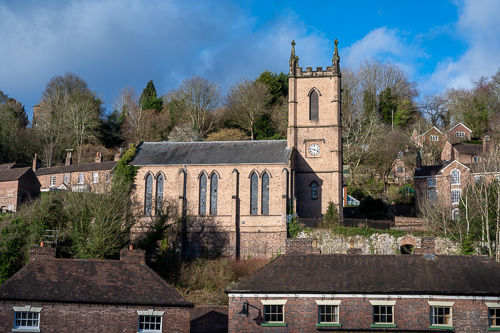
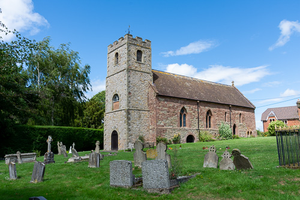

# Churches with Special, Unique and Individual Characteristics

Many of the churches in Shropshire have features that are unique or otherwise special.

## The Wrong Way Round - St Luke, ironbridge

The position of Ironbridge church is the reverse of the majority of churches, the sanctuary is at the west end and the tower at the east end. This is because the land at the west end would not bear the weight of a tower.

## Two Stories - St John the Baptist, Stapleton

The present church was built in the 12th Century and for reasons unknown it was originally a two storey building, a possibly unique feature amongst churches. The second storey was built on top of the very thick walls of a Saxon or Early Norman church. The church was on the upper floor and the ground floor is assumed to have been an undercroft (no trace now remains of the undercroft (removed in 1786). At one time the local population was protected from the Welsh on the ground floor. At another the congregation worshipped on the 1st floor level which has since been removed.

