# Name: St Mary, Acton Burnell
- Date: 1275 AD

This church is considered to be the finest Early English (13th Century) church in Shropshire.  Unlike most English parish churches, Acton Burnell is built in a same style throughout.

It features a corbel-table with many grotesque carvings (a corbel-table is a continuous row of corbels, and a corbel is a block of stone projecting from a wall and supporting some heavy feature).

Acton generally means "settlement (farm or estate) by the oaks" and this estate belonged to Robert Burnell an English bishop who served as Lord Chancellor of England from 1274 to 1292.

# Name: St Margaret, Acton Scott
- Date: 12th-14th Century AD

This is a church that has suffered at the hands of 19th Century restorers.  Much of the masonry is medieval, but the windows were all renewed in the 19th Century.  The porch was added in 1722 and the north chapel in 1820.

Acton generally means "settlement (farm or estate) by the oaks" and the "Scott" originates from the medieval name Reynold le. Scot who held a share in the manor in 1255.

The settlement was registered as Actune in the Domesday Book.

- Sub-Image: 2019-07-13_09_52_11_DSC_4607_DxO.jpg
- Sub-Image: 2019-07-13_09_53_10_DSC_4609_DxO.jpg

# Name: St Michael and All Angels, Alberbury
- Date: 1290 AD

The church is thought to have been founded between the 7th and 10th Centuries.  It was originally a Minster Church (Minster was the Anglo-Saxon version of a monastery, and was originally applied to churches served by monks / clergy living a communal life and endowed by a charter with the obligation of maintaining the daily office of prayer, but was not the seat of a bishop and the church had no diocesan responsibilities).

In the mid-12th century the church was given Shrewsbury Abbey, but was later assigned to Alberbury Priory.  The priory was founded in 1228 and was one of three dependencies of the French abbey of Grandmont (the priory itself was sited about one and a quarter miles away by the river Severn).  Being an 'alien' priory it was vulnerable to predators representing the king, the priory was finally suppressed by the king in 1441 and the estate passed to All Souls' college, Oxford.

The church was reconsecrated in 1290, following the cessation of a long-running series of Welsh border disputes.

The tower is Early English (approx. 1180 to 1270), it has a saddleback roof (a ridge and two sloping sides) - the only example of such in Shropshire.

The roof of the nave is thought to be one of the finest in the county.

The Loton Chapel was added in 1320, and contains a pre-Raphaelite window by Burne Jones.

There are two wall-monuments to Sir Richard Lyster, who was MP for Shrewsbury in the 18th Century, the imagery on one refers to a scene in the House of Commons when he protested against a decision of the House.

The place name derives from the Old English 'burh' (a fortified place) and the personal name Aluburg or Ealhburg.

# Name: St Eata, Atcham
- Date: Before 1075 AD

This is the only church in England dedicated to St Eata of Hexham.

The first church to St Eata is said to have been built in the 8th Century but there is no longer any trace of this.  The present church has been on this site since at least 1075, this is known because the chronicler Orderic Vitalis (a Benedictine monk who wrote one of the great chronicles of 11th and 12th Century England) was baptised at the church on Easter Day in 1075.

The oldest part of the present church is the nave which dates from the late Saxon or early Norman period.  The tower is probably late 12th Century, the chancel late 13th Century and the south porch is dated 1665.  The church was restored in the late 19th Century.

The church is constructed from red and grey sandstone and incorporates some large blocks from the Roman city of Wroxeter.

The name Atcham is a contraction of Attingham, meaning "the home of Eata's people".

- Sub-Image: 2020-01-12_15_52_57_DSC_6218_DxO.jpg
- Sub-Image: 2020-01-12_15_55_16_DSC_6223_DxO.jpg
- Sub-Image: 2020-01-12_15_55_58_DSC_6224_DxO.jpg
- Sub-Image: 2020-01-12_15_57_40_DSC_6226_DxO.jpg

# Name: St Mary Magdalene, Battlefield
- Date: 1406 AD

The church was built just after the Battle of Shrewsbury as a chantry - a place of intercession and commemoration for those killed in the fighting.  The building is probably constructed over a mass burial pit as it is thought that some of the battle was fought at the place now known as Battlefield.

The church was originally a collegiate church, the main duty of the community was to perform a daily liturgy for the dead.  The college and chantry were dissolved in 1548 and the building was used as a parish church.  The building, however, deteriorated and became unused, it has been subject to various restorations.
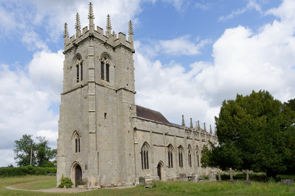

# Name: St Milburga, Beckbury
- Date: 14th Century AD

Beckbury was included in the Domesday Book and the name means Beocca's Fort or defended place (Beocca being a personal name).

The parish was originally part of the estates of Wenlock Priory from at least 1120 AD and the connection is reflected in the dedication to St Milburga.  In the Middle Ages, Beckbury was a dependent chapelry of the parish of Holy Trinity, Much Wenlock.

The chancel is possibly 14th Century, the nave and the tower were added in 1731.

- Sub-Image: 2020-02-01_12_48_58_DSC_6306_DxO.jpg
- Sub-Image: 2020-02-01_12_54_45_DSC_6315_DxO.jpg
- Sub-Image: 2020-02-01_12_56_28_DSC_6320_DxO.jpg
- Sub-Image: 2020-02-01_12_56_47_DSC_6321_DxO.jpg
- Sub-Image: 2020-02-01_12_57_06_DSC_6323_DxO.jpg
- Sub-Image: 2020-02-01_12_57_32_DSC_6324_DxO.jpg
- Sub-Image: 2020-02-01_12_58_35_DSC_6325_DxO.jpg

# Name: St Margaret, Betton Strange
- Date: 1858 AD

A well-preserved memorial chapel built for the Scott family.
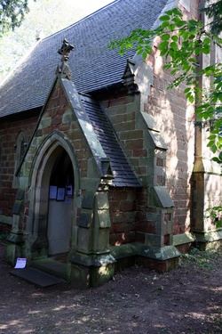
- Sub-Image: 2019-09-21_11_41_02_DSC_5080_DxO.jpg

# Name: St John the Baptist, Bishop's Castle
- Date: 13th Century AD

Bishop's Castle is named from the castle built there by the Bishop of Hereford in circa 1127.

The original church was built towards the end of the 13th century to serve the medieval town controlled by the Bishops of Hereford.  Only the tower remains of the original church (but this was rebuilt in 1648 after the church was badly damaged in 1645 during the Civil War).  The rest of the church was completely re-built in 1869-60 by Thomas Nicholson in the Victorian Gothic style.

During the rebuild, an Early English (1180-1275) doorway was removed and is now in the wall of the vicarage garden.

- Sub-Image: 2020-08-08_14_29_50_DSC_7952_DxO.jpg
- Sub-Image: 2020-08-08_14_31_41_DSC_7954_DxO.jpg
- Sub-Image: 2020-08-08_14_32_25_DSC_7956_DxO.jpg
- Sub-Image: 2020-08-08_14_36_52_DSC_7965_DxO.jpg
- Sub-Image: 2020-08-08_14_37_05_DSC_7966_DxO.jpg
- Sub-Image: 2020-08-08_14_37_19_DSC_7967_DxO.jpg
- Sub-Image: 2020-08-08_14_38_02_DSC_7969_DxO.jpg
- Sub-Image: 2020-08-08_14_38_47_DSC_7972_DxO.jpg
- Sub-Image: 2020-08-08_14_43_36_DSC_7978_DxO.jpg
- Sub-Image: 2020-08-08_14_47_47_DSC_7983_DxO.jpg
- Sub-Image: 2020-08-08_14_48_01_DSC_7984_DxO.jpg

# Name: St Mary, Bitterley
- Date: 13th Century AD

The church dates mostly fron the Transitional period (when the Norman style was giving way to Early English style).

In the Dommsday book, the nearby manor is known as Buterlie (Butter Pasture).

- Sub-Image: 2019-08-26_14_06_40_DSC_4867_DxO.jpg
- Sub-Image: 2019-08-26_14_08_15_DSC_4868_DxO.jpg

# Name: St Leonard, Bridgnorth
- Date: 12th Century AD

Although not mentioned in the Domesday book, there is Anglo-Saxon and Norman stonework in the fabric of the church and so it is likely that an earlier church stood on the site of the present church.

During the Civil War the Parliamentarians used the church to store ammunition, this was ignited by a cannon shot - the north aisle and part of the south aisle were destroyed.  The roof and nave were rebuilt in 1662, but the church was not fully restored until 1860.
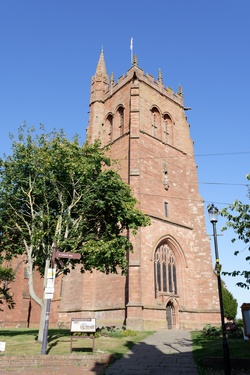

# Name: St Mary Magdalene, Bridgnorth
- Date: 1792 - 1795 AD

The church was designed by Thomas Telford.

It is aligned north-south, rather than the more usual west-east.

# Name: Holy Trinity, Buildwas
- Date: 1720 AD

The name Buildwas may derive its name from the Saxon words "beild" or "belde" (a shelter). and "was" (water), surrounded as it is on three sides by hills and on the fourth by the river Severn.  Another view is that the name is from the Old English "waesse" which means "swamp" or "marsh" and is usually translated as "land by a meanering river which floods and drains quickly".

The village of Buildwas has been recognised since 1086 as the first reference to it was made in the Domesday Book.

There has been a church on the present site since medieval times, the present church dates from 1720.  The chancel was rebuilt in 1864, a painting from 1790 shows a shorter western turret with a flatter pyramid top - the present timber-framed belfry probably also dates from 1864.

Within the church are memorial tablets to members of two local families who were closely linked to the Industrial Revolution.  In the churchyard, there are some unusual cast iron headstones and tombstones, which were cast locally.

# Name: St Mary, Burford
- Date: 12th Century AD

The church comprises a mixture of medieval and Victorian elements; the chancel is 12th Century the nave and tower are later and date from the 14th Century.  In 1889-90 the church was extensively restored by Aston Webb, an English architect who designed the principal facade of Buckingham Palace and the main building of the Victoria and Albert Museum.

The Old English name means "Ford by the Fort".

# Name: St Michael, Cardeston
- Date: 1276 AD

The church is known to have existed prior to 1276, as there is one window in the chancel in the present building from before that date.  By the 18th Century, the medieval church was in a poor state of repair and it was replaced by a new building in 1749, the building was significantly remodelled in 1844.

The church is notable for its unusual tower as the square lower stage becomes octagonal above angle broaches.

# Name: St James, Cardington
- Date: 12th Century AD

The presence of a church on the site is recorded in the Domesday Book.  In 1167, the village, including the church, was given to the Knights Templar (and was known as Templars' Cardington, allowing the people to share the privileges of the Knights).  It remained in their possession until 1308 (when the order was supressed).  The Knights were responsible for starting the building of the present church in the later part of the 12th Century.  During the following century the chancel was rebuilt and extended, and the tower was added.  Further additions and alterations were made during the following three centuries, followed by the porch in 1639.

The body of the church is constructed in sandstone rubble with ashlar dressings and has tiled roofs.  The south doorway contains a door dated 1648.

In the churchyard is a sandstone sundial dating from the middle of the 18th Century.

In the Domesday Book the village is referred to as "Cardintine under the Fief of Rainwald Vicecomes" and it is mentioned that there were 11 leagues of woodland.  The name "Cardington" derives from an English chief and warrior named Carda, whose sons and followers were called the Cardinga.  They made their home where the village is, and the village they built became known as Cardington, or the town of the sons of Carda.

In the church is a large monument to Chief Justice of Leighton of Plaish (died 1607), this Jacobean monument is the earliest in Shropshire which depicts the deceased lying on his side. 

Judge Leighton was known as "the hanging judge" (as was Judge Jeffries) as he condemned so many people to be hanged.  Amongst those condemned by Leighton was a local builder, who had come to the judge to ask to be pardoned for his crime.  The Judge promised him that if he would build him the finest set of chimneys he had ever yet built he would spare his life.  The builder did construct the chimneys (on Plaish Hall).  But after completing the job the Judge ordered the mans' eyes to be put out, and for him to be hanged from the same chimneys he had just built (so that he could build no more chimneys ever finer).  It is said that one can see the rope with which the builder was hanged.

- Sub-Image: 2020-02-08_11_55_02_DSC_6349_DxO.jpg
- Sub-Image: 2020-02-08_11_56_19_DSC_6352_DxO.jpg
- Sub-Image: 2020-02-08_12_02_45_DSC_6356_DxO.jpg
- Sub-Image: 2020-02-08_12_08_27_DSC_6359_DxO.jpg
- Sub-Image: 2020-02-08_12_09_43_DSC_6361_DxO.jpg
- Sub-Image: 2020-02-08_12_11_24_DSC_6362_DxO.jpg
- Sub-Image: 2020-02-08_12_16_11_DSC_6363_DxO.jpg
- Sub-Image: 2020-02-08_12_22_49_DSC_6367_DxO.jpg
- Sub-Image: 2020-02-08_12_29_55_DSC_6371_DxO.jpg

# Name: St Peter, Chelmarsh
- Date: 14th Century AD

The place name is thought to derive from the Old English Cegel, meaning pole, as it is believed that the marsh may have been marked out by posts.

Although there is evidence of a Norman church existing on the site, the present church dates from the 14th Century.  The brick tower dates from the early 18th Century.
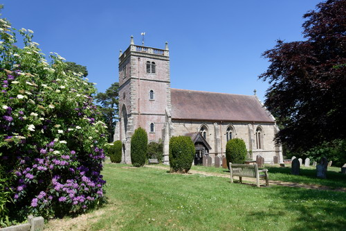
- Sub-Image: 2020-05-30_12_49_48_DSC_7212_DxO.jpg

# Name: St Michael the Archangel, Chirbury
- Date: 12th Century AD

An Anglo-Saxon church was founded circa 915 when a fort was built on the site.  The current building dates from the 12th Century.  The aisles and arcades were added in the 13th Century - the arcades noticeably lean outwards.  The tower was constructed around 1300 and the chancel was added in 1733.  The church was restored in 1871-72.  The tower and body of the church were constructed using limestone rubble with pink sandstone ashlar dressings and slate roofs.  The chancel is red brick with a tiled roof.

In the Anglo-Saxon Chronicle the place name was recorded as Cyricbyrig.  Later in 1086 in the Domesday book, the place name was recorded as Cireberie which means "a fortified place with a church".

The church was reformed into the church of the Augustinian Priory at Chirbury when the order relocated from Snead (near Bishop's Castle) round about 1220.  With the dissolution of the Priory in 1535, the church became a parish church once again.  The church as seen today is the nave of the Priory.

- Sub-Image: 2020-03-14_14_12_39_DSC_6785_DxO.jpg
- Sub-Image: 2020-03-14_14_21_50_DSC_6789_DxO.jpg
- Sub-Image: 2020-03-14_14_25_48_DSC_6794_DxO.jpg
- Sub-Image: 2020-03-14_14_26_16_DSC_6795_DxO.jpg
- Sub-Image: 2020-03-14_14_26_53_DSC_6797_DxO.jpg
- Sub-Image: 2020-03-14_14_28_52_DSC_6800_DxO.jpg
- Sub-Image: 2020-03-14_14_29_23_DSC_6801_DxO.jpg
- Sub-Image: 2020-03-14_14_30_38_DSC_6802_DxO.jpg
- Sub-Image: 2020-03-14_14_31_22_DSC_6803_DxO.jpg
- Sub-Image: 2020-03-14_14_33_07_DSC_6806_DxO.jpg
- Sub-Image: 2020-03-14_14_35_30_DSC_6808_DxO.jpg
- Sub-Image: 2020-03-14_14_38_26_DSC_6812_DxO.jpg
- Sub-Image: 2020-03-14_14_39_36_DSC_6813_DxO.jpg
- Sub-Image: 2020-03-14_14_40_41_DSC_6814_DxO.jpg
- Sub-Image: 2020-03-14_14_41_05_DSC_6815_DxO.jpg
- Sub-Image: 2020-03-14_14_41_31_DSC_6818_DxO.jpg
- Sub-Image: 2020-03-14_14_46_07_DSC_6820_DxO.jpg

# Name: St Edith, Church Pulverbatch
- Date: 1773 AD 

The name Pulverbatch means the valley of the river Pulre.  The village of Church Pulverbatch is also known as Churton.  The manor is recorded in the Domesday book as Polrebec.

The medieval church (the church's first known priest was 'John the Chaplain', recorded before 1193) was destroyed by the Welsh some time around 1400, the successor building was constructed in the Georgian style in 1773.  However, the nave, chancel and north aisle were restored in the 1850s.

The churchyard contains a number of tombs of interest, including an urn shaped tomb dating from the 18th Century.  The churchyard is circular and was thought to have been a defensive site, there are a number of mature yew trees in the churchyard.

- Sub-Image: 2020-06-27_13_49_27_DSC_7333_DxO.jpg
- Sub-Image: 2020-06-27_13_58_21_DSC_7342_DxO.jpg
- Sub-Image: 2020-06-27_13_58_53_DSC_7343_DxO.jpg

# Name: St Laurence, Church Stretton
- Date: 12th Century AD

The Domesday book makes reference to a church in the Manor existing before the Norman conquest, most likely a small wooden building.

The name Stretton is derived from the old name Stratun which means "tun" (settlement) near to the "Street" or Roman Road.

The Norman church was probably built around 1110 to 1130 as the region was growing in prosperity and population (and the Welsh boarder was quieter).

The church was extended in circa 1214 AD - a new chancel, transcepts in the form of a cruciform and the lower tower were constructed.  A century or so later, the windows were enlarged and the tower was extended.

- Sub-Image: 2020-02-08_15_32_15_DSC_6505_DxO.jpg
- Sub-Image: 2020-02-08_15_32_39_DSC_6506_DxO.jpg
- Sub-Image: 2020-02-08_15_33_08_DSC_6507_DxO.jpg
- Sub-Image: 2020-02-08_15_34_23_DSC_6511_DxO.jpg
- Sub-Image: 2020-02-08_15_34_48_DSC_6512_DxO.jpg
- Sub-Image: 2020-02-08_15_35_05_DSC_6513_DxO.jpg
- Sub-Image: 2020-02-08_15_35_22_DSC_6514_DxO.jpg
- Sub-Image: 2020-02-08_15_35_42_DSC_6516_DxO.jpg
- Sub-Image: 2020-02-08_15_36_12_DSC_6518_DxO.jpg
- Sub-Image: 2020-02-08_15_36_29_DSC_6519_DxO.jpg

# Name: All Saints, Claverley
- Date: 12th Century AD

The church can trace its origins back to the 7th Century (Saxon), however, the present church dates from the 12th Century.

Roger de Montgomerie, 1st Earl of Shrewsbury, held the manor and the church was connected with the collegiate foundation which he endowed at Quatford.

The church was added to in the 13th and 15th Centuries - the tower was doubled in height and angle buttresses were added to it towards the end of the 15th century.  At about the same time the north chapel was added.

The church is noted for the medieval wall paintings which have been dated to circa 1200.

The name Claverley means 'clover meadow'.

# Name: St Margaret, Clee St Margaret
- Date: Saxon / Norman

The name of the village derives from the Old English 'cleo' (clee) meaning a ball, used in this case to mean a ball-shaped hill (referring to the distictive shape of the Clee Hills) and the saint to which the church is dedicated.

The exact date of the church is unknown, although there was probably a Saxon church on the site.  The most notable feature of the present building is the extensive herring-bone masonry.

# Name: St Luke, Coalbrookdale
- Date: 1854 AD

With the support of the Darbys a new church was planned for the village of Coalbrookdale.  The foundation stone was laid by Abraham's wife, Matilda Frances, on 11th December 1851 and the completed building was consecrated by the Bishop of Hereford on 25th July 1854.

The church is notable because unusually a number of the gravemarkers were locally cast in iron.

The most notable grave is that of Abraham Darby IV and his Wife Matilda.

# Name: St Mary, Cleobury Mortimer
- Date: 12th Century AD

Cleobury passed to the Mortimer family (one of the great Marcher families) after the Norman conquest.

The church is largely Early English.  The arcades lean outwards and were first stabilised by Thomas Telford in the 1790s, buttresses were added later.

The shingled spire is not quite symmetrical when seen from certain viewpoints.

# Name: St Simon and St Jude, Cockshutt
- Date: 1777 AD

A plain brick building constructed to replace the medieval church (dedicated to St Helena) which fell into dis-repair. The church clock (made in 1789) is thought to be the only collaborative piece between two well-known Shropshire clockmakers - Bullock and Davies.

- Sub-Image: 2019-09-18_14_55_20_DSC_5076_DxO.jpg

# Name: Christ Church, Cressage
- Date: 1841 AD

The name Cressage means "Christ's Oak", and so it is thought the village's location may be a very early Christian site (possibly an oak tree from where the gospel was preached).

There was a medieval church at Cressage, but it suffered repeated flooding from the nearby river Severn and so the current church was built on higher ground.  The rather austere church was architected by Edward Haycock snr (Haycock was responsible for 14 churches in Shropshire, other work by him includes Millichope Park and the Lord Hill monument in Shrewsbury).

The octagonal pulpit is made of panelling from St Samson's church (the old medieval church).

# Name: St Mary, Crudgington
- Date: 1863 AD

Crudgington is mentioned in the Domesday Book, where it is called Crugetone.  The name derives from the old English of the village (tun) by the hill-hill, presumably referring to its proximity to the Wrekin.

# Name: St Peter, Diddlebury
- Date: 11th Century (or earlier) AD

One of only about 20 churches in Shropshire mentioned in the Domesday book (under the manor of Corfham) and therefore of known Saxon origin.

The name Diddlebury derives from the Old English name Duddela and burgh (settlement of).

The most striking internal feature is the herring-bone masonry in the north wall of the nave.

- Sub-Image: 2019-12-14_12_56_14_DSC_5992_DxO.jpg
- Sub-Image: 2019-12-14_12_59_16_DSC_5995_DxO.jpg

# Name: St Edward, Dorrington
- Date: 1845 AD

The church was paid for by J T Hope of Netley Hall.  In the 1840s the Early English style was dominant in Shropshire, and this church conforms to that style.  The church is built of ashlar.

The name Dorrington derives from the Old English Deoringtun meaning 'settlement (tun) associated with Deor(a)', Deor being a personal name.

- Sub-Image: 2020-08-01_16_10_54_DSC_7781_DxO.jpg
- Sub-Image: 2020-08-01_16_12_10_DSC_7782_DxO.jpg
- Sub-Image: 2020-08-01_16_12_23_DSC_7785_DxO.jpg
- Sub-Image: 2020-08-01_16_13_53_DSC_7787_DxO.jpg

# Name: St Mary, Ellesmere
- Date: 1840s AD

Originally a medieval church of the which the tower and chancel chapels, but little else, remain, as by the 1840s the church was in a poor state.  Sir George Gilbert Scott was asked to advise and recommended that the dilapidated nave be rebuilt completely - this advice was accepted the present chchuch is largely his work.

# Name: St Catherine, Eyton upon the Weald Moors
- Date: 1743 AD

The name Eyton upon the Weald Moors is derived from the Old English Eg-tun meaning settlement on an island or in land by a river, and Weald which means wild or waste moor.

The church is built of red brick.  The apse was added in 1850 in the same style.

# Name: St Thomas, Halford
- Date: 12th Century AD

The place name Halford means hawkers’ ford (hawker meaning travelling seller) - the Ford is across the river Onny that runs very close to the church.

The church is of Norman origin, and was restored in 1848.  The chancel was totally rebuilt in 1887.

# Name: St Luke, Hodnet
- Date: 12th Century AD

Noted for its tower which is entirely octagonal from top to bottom and the only tower of this type in Shropshire.  In 2006 the church was damaged by people apparently seeking clues in a search for the Holy Grail.

The church is constructed of sandstone.

Hodnet's name has Celtic origins derived from the Welsh hawdd meaning pleasant or peaceful and nant, a glen or valley.

# Name: St John the Baptist, Hope Bagot
- Date: 12th Century AD

A small church in a delightful spot, it has an impressive Norman chancel arch.

In the churchyard is an ancient yew tree, thought to be well over 1000 years old.

Hope means an enclosed place or valley and Bagot is a derivation of Richard Bagard's name (who held the manor in 1242).
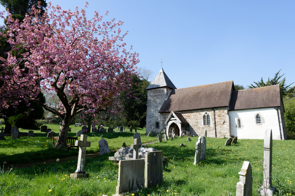
- Sub-Image: 2019-04-19_14_33_15_DSC_4121_DxO.jpg

# Name: St Andrew, Hope Bowdler
- Date: 1863 AD

Hop(e) is the Middle English for valley.  The name Bowdler derives from the Norman name de Bulers.

Hope Bowdler is recorded in the Domesday book as Fordritishope.

There was a medieval church on the site, this was replaced in 1863 by the present building.  The church is built of Soudley banded sandstone.  It was designed by Shrewsbury architect Samuel Pountney Smith.

# Name: St John the Baptist, Ightfield
- Date: 1490 AD

Mentioned in the Doomsday book as Istefelt, the name Ightfield may derive from the Old English "Ihtfeld" (Iht means creature and Feld means field), referring to the fact that the area was rural and farming was prevalent.  Alternatively, it is thought it could dervice from Giht, an ancient British river name.

The church has 15th Century origins and was partly rebuilt in the 19th Century (although records show a church here dedicated to St John the Baptist in 1072 AD).

- Sub-Image: 2019-12-21_14_54_15_DSC_6034_DxO.jpg
- Sub-Image: 2019-12-21_14_59_16_DSC_6042_DxO.jpg
- Sub-Image: 2019-12-21_15_09_36_DSC_6049_DxO.jpg
- Sub-Image: 2019-12-21_15_13_05_DSC_6052_DxO.jpg

# Name: St Luke, Ironbridge
- Date: 1837 AD

The area was originally part of the parish of Madeley, but with the growth of the population due to the bridge, it was thought necessary for Ironbridge to have its own church.

The position of Ironbridge church is the reverse of the majority of churches, the sanctuary is at the west end and the tower at the east end.  This is because the land at the west end would not bear the weight of a tower.

# Name: St Mary, Jackfield
- Date: 1863 AD

The present church was build in 1863 to replace a chapel (dating from 1759).  The church was designed by Sir Arthur Blomfield and is considered to be the best of the four Shropshire churches he designed.  Blomfield was a prolific architect, and a leading figure in his profession.

The church has an unusual bell-turret, the style is French Gothic which was in vogue in the 1860s.  The church is most noted for its tiles - there are both Maws and Craven Dunhill tiles in the building.

# Name: St Mary, Kinnerley
- Date: 15th Century AD

The mother church of all churches south of Oswestry.

The church came into the Diocese of Lichfield on the disestablishment of the Welsh Church.

The lower part of the tower is medieval and dates to the late 14th Century or early 15th Century.  The church was rebuilt in 1773 / 1774.  The font is probably 12th Century.
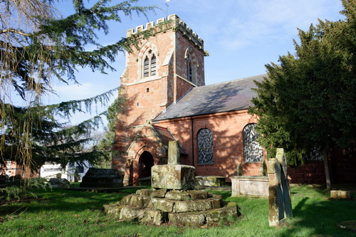
- Sub-Image: 2020-01-18_12_38_49_DSC_6244_DxO.jpg
- Sub-Image: 2020-01-18_12_39_03_DSC_6245_DxO.jpg
- Sub-Image: 2020-01-18_12_41_23_DSC_6246_DxO.jpg
- Sub-Image: 2020-01-18_12_41_53_DSC_6247_DxO.jpg
- Sub-Image: 2020-01-18_12_43_58_DSC_6250_DxO.jpg
- Sub-Image: 2020-01-18_12_48_52_DSC_6252_DxO.jpg

# Name: St Paul, Knowbury
- Date: 1838-9 AD

The original church was described as being a barn-like structure.  It was radically altered in 1884 to produce the current building mainly in the Decorated style.

- Sub-Image: 2019-04-19_14_01_24_DSC_4106_DxO.jpg

# Name: St Chad, Kynnersley
- Date: 13th Century

The original parts of the church are medieval.  The tower was added in 1722-23.

The name of the village derives from the Old English personal name Cynheard and the Old English word leah, which meant forest clearing.  The place-name as a whole meant forest clearing belonging to Cynheard.

# Name: All Saints, Little Stretton
- Date: 1903 AD

The building is painted to look half-timbered.  However, the whole interior is wooden.

# Name: St Michael the Archangel, Llanyblodwel
- Date: 1847-1853 AD

The present church was the result of rebuilding the old medieval church in stages between 1847 and 1853 by the then vicar.  The almost detached steeple was designed and added in 1855-6 by the same vicar, he was convinced that the shape would be stronger than the usual hollow spire construction where the thickness of the straight sides diminishes towards the apex.  The height is 104 ft (tower 57 ft and spire 47 ft).

The place name means "an enclosure (especially a church or churchyard) by a spring or well which is red (this may refer to a red-leaved tree or red soil)".
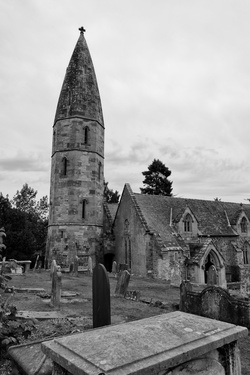
- Sub-Image: 2019-08-03_11_40_25_DSC_4701_DxO.jpg
- Sub-Image: 2019-08-03_11_40_49_DSC_4702_DxO.jpg

# Name: St Ruthen, Longden
- Date: Pre-1569 AD

The age of the church is unknown, but will have existed prior to 1569 as records from that year mention a chapel on the site.

The wooden bell turret houses a bell of pre-reformation age.

This is the only church in England to be named after St. Ruthen - probably a Welsh saint.

- Sub-Image: 2019-08-31_15_47_20_DSC_4969_DxO.jpg

# Name: St Bartholomew, Longdon on Tern
- Date: 1742 AD

The name Longdon is derived from two Old English words, lang and dun, meaning long hill.  The settlement is also situated on the river Tern, a tributary of the river Severn.

The church was significantly altered in 1854.

# Name: St Laurence, Ludlow
- Date: 12th Century AD

One of the greatest parish churches in England.

Nothing remains of the original 11th Century church, but 100 years later a second church was built in a style of mixed Norman and early-English.  It is thought that a barrow was removed in 1199 to enlarge the churchyard.

There was a massive rebuilding of the church between 1433 and 1471, much of which was paid for by the wealthy Palmers' Guild, which endowed a number of chantries in the church.

- Sub-Image: 2020-01-04_15_00_51_DSC_6105_DxO.jpg
- Sub-Image: 2020-01-04_15_02_01_DSC_6107_DxO.jpg
- Sub-Image: 2020-01-04_15_03_33_DSC_6110_DxO.jpg
- Sub-Image: 2020-01-04_15_06_03_DSC_6111_DxO.jpg
- Sub-Image: 2020-01-04_15_11_18_DSC_6119_DxO.jpg
- Sub-Image: 2020-01-04_15_13_36_DSC_6123_DxO.jpg

# Name: St John, Ludlow
- Date: 1881 AD

A suburban church built by Sir Arthur Blomfield (English architect).

# Name: Holy Trinity, Lydham
- Date: Circa 1200 AD

There was probably a Saxon church here as Lidum is mentioned in the Doomsday book.  The present church is of medieval origin, but was substantially rebuilt in 1642.

The churchyard is noted as it has 35 yews shaped by a topiarist.  The church also has an excellent roof.

The origin of the name Lydham is unknowm, but may be the old English for "at the gates" or "at the slopes".
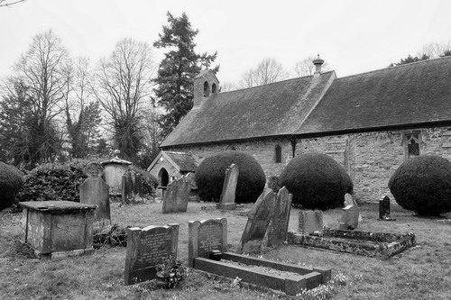
- Sub-Image: 2020-01-25_14_59_41_IMG_6240_DxO.jpg
- Sub-Image: 2020-01-25_15_04_00_DSC_6291_DxO.jpg
- Sub-Image: 2020-01-25_15_04_52_DSC_6292_DxO.jpg
- Sub-Image: 2020-01-25_15_05_26_DSC_6293_DxO.jpg
- Sub-Image: 2020-01-25_15_06_34_DSC_6294_DxO.jpg

# Name: St Peter, Melverley
- Date: 12th Century AD

Melverley means "meadow by the mill-ford".

The church stands very close to the river Vyrnwy.

The medieval church was burnt by Owain Glyndwr in 1401.  The present church was built soon after.

It is noted for being one of just a small number of half timbered churches in the country.  The entire structure is held together with just pegs.  The fact that the wattle and daub is narrower than the timbers shows the early construction of this church using this technique.

- Sub-Image: 2019-06-01_11_16_57_DSC_4422_DxO.jpg
- Sub-Image: 2019-06-01_11_20_14_DSC_4424_DxO.jpg

# Name: St Bartholomew, Moreton Corbet
- Date: 12th Century AD

The Norman church was founded in about 1140 AD as a chapel attached to Shawbury.  Some parts of the Norman church remain, but the greater part of the church dates from the 14th Century.

The church has an unusual triangular window, similar to one in Alberbury, which was another of the Corbet family's holdings.

# Name: St Gregory, Morville
- Date: 1118 AD

The church retains almost all of the original Norman features and was constructed within the precincts of a Priory establishment.  This was destroyed in 1540 leaving the church as the parish place of worship.

# Name: Holy Trinity Church, Much Wenlock
- Date: 1150 AD

Built by the Cluniac monks of Wenlock Priory.

# Name: St Michael, Munslow
- Date: 12th Century AD

The church has its origins in the 12th Century, but has grown and been modified over the years.

The church is noted for its 14th Century wooden porch and medieval stained glass.

The lower stages of the tower are Norman and the upper stages are Perpendicular.

The name Munslow derives from the old English hlaw (low) meaning tumulus or burial mound.  Th eorigin of the first part of the name is uncertain, but it is throught to derive from the Saxon name Mundel.

- Sub-Image: 2019-09-28_13_26_29_DSC_0011_DxO.jpg
- Sub-Image: 2019-09-28_13_26_29_DSC_0016_DxO.jpg
- Sub-Image: 2019-09-28_13_26_29_DSC_0018_DxO.jpg
- Sub-Image: 2019-09-28_13_26_29_DSC_0019_DxO.jpg
- Sub-Image: 2019-09-28_13_26_29_DSC_0004_DxO.jpg
- Sub-Image: 2019-09-28_13_26_29_DSC_0006_DxO.jpg
- Sub-Image: 2019-09-28_13_26_29_DSC_0007_DxO.jpg
- Sub-Image: 2019-09-28_13_26_29_DSC_0009_DxO.jpg

# Name: St John the Baptist, Myndtown
- Date: 12th Century AD

The church may even date back to before the 12th Century.  It is thought to be unique not just within Shropshire, but in the whole of England, in that it has not been the subject of Victorian restoration or alteration.  It is a simple and plain country church.

The church has two bells, one is 15th Century, and the other is from 1150, making it one of the oldest bells listed in the National Bell Register.

Some of the roof timbers have been identified as being from trees felled between 1225 and 1250, which makes them some of the oldest in situ church roof timbers.  The original roof was replaced after about 100 years, the timbers in the replacement roof are from trees felled between 1326 and 1348.

The name Myndtown literally means place or town by the mynd (mountain).  Myndtown was once a significant medieval village.  The village is recorded as "Munete" in the Domesday book.

- Sub-Image: 2020-03-21_13_56_02_DSC_6896_DxO.jpg
- Sub-Image: 2020-03-21_13_56_46_DSC_6897_DxO.jpg
- Sub-Image: 2020-03-21_13_57_23_DSC_6898_DxO.jpg

# Name: St Nicholas, Newport
- Date: 12th Century AD

Although the church dates back to the 12th Century, virtually nothing from this time survives.

Externally the building is a medieval west tower and a Victorian church (both of red sandstone).

# Name: St Oswald, Oswestry
- Date: 13th Century AD

In 642 AD Oswald, the King of Northumbria who had previously converted to Christianity was killed by the pagan King Penda of Mercia in the Battle of Oswestry, as a result he rose to martyrdom.  He is thought to have been killed on the site of the church.

The present church was built in the 13th Century.  Only the lower parts of the tower remain from the original building as the church was heavily damaged in the Civil War (having been used as a lookout tower).  The church was rebuilt in the 17th Century and further restored in the 19th Century.  Most of the windows are Victorian.

The church has a memorial to the Yale family - a descendant of the figures in the memorial made his fortune in India in the 18th Century and gave his money to a fledgling university in the USA - Yale.

- Sub-Image: 2019-06-01_13_55_10_DSC_4469_DxO.jpg
- Sub-Image: 2019-06-01_13_57_28_DSC_4473_DxO.jpg

# Name: St Raphael and St Isidore, Petton
- Date: 1727 AD

The present building was built in 1727 to replace the old medieval church.

Although the exterior is plain, the interior contains many items collected from home and abroad.

The name Petton is derived from the Old English "peac" meaning a knoll, a hill or a peak and tun meaning an enclosure, a farmstead, a village or an estate.

# Name: St Michael and All Angels, Pitchford
- Date: 1220 AD

The church founded and built by Ralph de Pitchford.

Noted for a solid oak carved tomb effigy (one of only three in the country) of a crusader called Sir John De Pitchford.

- Sub-Image: 2019-06-19_15_56_04_DSC_4539_DxO.jpg
- Sub-Image: 2019-06-19_15_58_52_DSC_4540_DxO.jpg

# Name: St Chad, Prees
- Date: 14th Century AD

Prees is thought to be an ancient Celtic name meaning brushwood or grove.

The church is a mixture of styles, Gothic nave, 18th Century tower and Victorian chancel.  It is thought that the whole church was rebuilt in the 14th Century
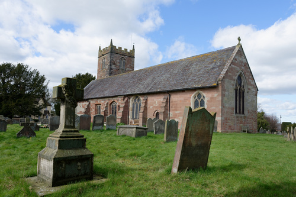
- Sub-Image: 2019-03-24_12_20_27_DSC_3610_DxO.jpg

# Name: St Laurence, Preston-upon-the-Weald Moors
- Date: 1742 AD

The current church was built between 1739 and 1742 to replace the former church.  The chancel and vestry were added in 1853.

The name Preston upon the Weald Moors (24 letters) is one of the longest names of any village in England and is thought to have derived from the words 'Priests' farm/settlement' on the 'wild moors' indicating that the village may well have ecclesiastical origins.
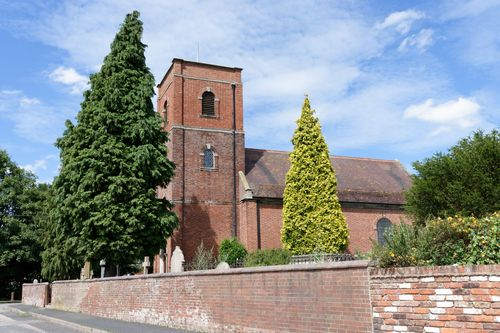
- Sub-Image: 2020-07-12_14_03_00_DSC_7403_DxO.jpg
- Sub-Image: 2020-07-12_14_05_40_DSC_7404_DxO.jpg

# Name: St Margaret, Ratlinghope
- Date: 1209 AD

Ratlinghope is thought to mean "the valley of Rotel's people" and is set in some of the finest scenery in the county.

It is likely that most of the building is 17th Century as there are few traces of the the priory that was here until the Dissolution in 1536.
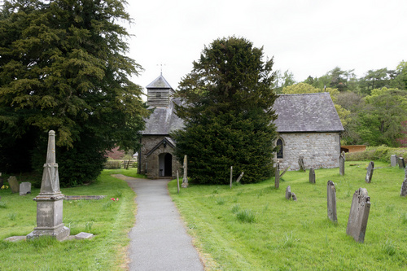
- Sub-Image: 2019-05-06_15_41_00_DSC_4228_DxO.jpg

# Name: St Mary, Selattyn
- Date: 1291 AD 

The village is close to Offa's Dyke and the dyke bounds the parish on the west, the name derives from sulh and tun which means in Old English a plough(-land) farm/settlement, or perhaps, a gully farm/settlement and has also been modified by Welsh influence.

The churchyard has a number of very old yew trees, suggesting that the site has been a place of Christian worship for over 1000 years.  However, the church itself is first mentioned in the Papal Tax records in 1291.  The church is noted for its 13th Century font and the barrel roof over the chancel, which is thought to be from the 14th Century.  The north and south transepts were added in 1821-28.  The church was extensively rebuilt in 1891-92.

# Name: All Saints, Shelve
- Date: 1839 AD

The present church was built to replace a medieval structure and is built in the Early English style.  The church contains items from the former church, specifically the rood-beam above the sanctuary, the nine-sided font (which may be Norman) and some 17th Century panelling.

This church is one of the highest in the county at 1,150 feet above sea level.

The place name likely derives from the fact it is situated on an area of relatively flat ground in an otherwise undulating terrain, as in "shelf" of level ground.

- Sub-Image: 2020-03-21_11_07_03_DSC_6846_DxO.jpg
- Sub-Image: 2020-03-21_11_09_12_DSC_6847_DxO.jpg
- Sub-Image: 2020-03-21_11_10_09_DSC_6848_DxO.jpg
- Sub-Image: 2020-03-21_11_14_35_DSC_6852_DxO.jpg

# Name: St James, Shipton
- Date: 12th Century AD

The nave and lower part of the tower date from the last 12th Century.  Noted for its Elizabethan chancel, as hardly any churches were built during the reign of Elizabeth I.

Shipton means "sheep farm".

In the church there is a tablet recording the departure of four children of Samuel More on the Mayflower in 1620.

# Name: St Mary, Shrewsbury
- Date: 12th Century AD

This church dominates Shrewsbury as was built at the highest point in the town and has a spire which is 222ft (one of the tallest in the country).

The church was largely transformed into its present state in the 12th Century (when Norman (transitional) architecture was giving way to Early English).

St Mary's is considered to have one of the finest collections of stained glass in the country, largely brought in from elsewhere.

# Name: St Chad (old), Shrewsbury
- Date: 12th Century AD

St Chad's may well be the oldest church in Shrewsbury, possibly originating in the 7th Century.

In 1788 the tower collapsed and all that remains is the south chancel chapel.
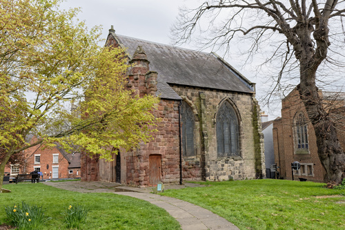

# Name: St Alkmund, Shrewsbury
- Date: 1475 AD

St Alkmund died circa 802 AD, he was the younger son of Alhred (king of Northumbria) at Lilleshall, his relics were removed to the collegiate church dedicated to him at Derby.  This church in Shrewsbury was also founded as a collegiate church in 912 AD by Aethelflaed, daughter of Alfred the Great, king of Mercia.  By the time of the Domesday survey, the church was substantially endowed.  However, when Lilleshall Abbey was established in 1148 AD, the church became an poor vicarage as property was transferred to Lilleshall.

The church stands at the highest point in the town.

The original medieval church is thought to have been a very fine example.  However, following the collapse of Old St Chad's in 1788, there was concern about the safety of the church.  An act of Parliament decreed the demolition and rebuilding of all but the tower.

The present tower and spire were built around 1475 AD.  The rest of the present church is Georgian.
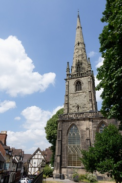

# Name: St Chad (new), Shrewsbury
- Date: 1792 AD

St Chad was the first Bishop of Mercia, he was canonised in 779 AD.

After the collapse of the tower of the original St Chad's church, the new church was built to a design by George Steuart (who had previously designed Attingham Park).

This church is considered to be the finest 18th Century church in Shropshire.  The most striking feature being the circular nave.  The church is brick built and faced with Grinshill stone.

- Sub-Image: 2019-12-22_11_38_13_IMG_6208.jpg
- Sub-Image: 2019-12-22_11_47_16_IMG_6212.jpg
- Sub-Image: 2019-12-22_11_56_02_IMG_6218.jpg
- Sub-Image: 2019-12-22_11_37_34_IMG_6206.jpg

# Name: St Julian, Shrewsbury
- Date: 12th Century AD

This church is one of the four Saxon foundations in Shrewsbury.  The tower dates from the 12th Century whereas the present nave was designed by Thomas Farnolls Pritchard who also designed the Iron Bridge at Telford.  Pritchard was born in Shrewsbury and baptised in St Julian's Church on 11 May 1723.
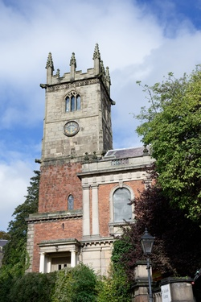

# Name: Congregational Church, Shrewsbury
- Date: 1863 AD

Originally known as the Abbey Foregate Congregational Church (a church in which each congregation independently and autonomously runs its own affairs).  The site was bought in 1872 and worship began, immediately.  Work on the building started at once and the foundation stone was laid in 1863.

In 1972 the church became a United Reformed Church.
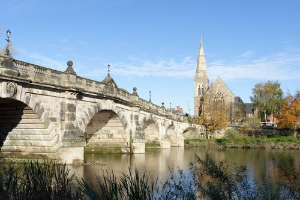

# Name: St Michael & All Angels, Smethcott
- Date: 12th Century AD

Although not mentioned in any records before 1341, the building does retain some 12th Century features.  Over the years the church fell into disrepair and was rebuilt in 1850.

Smethcott means "the smith's cottage".
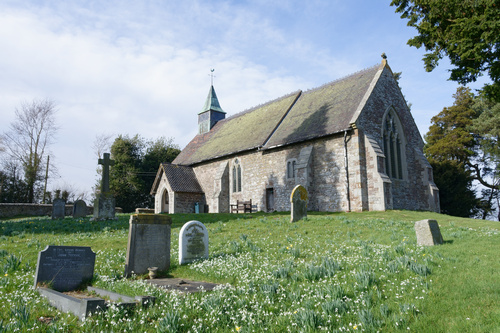
- Sub-Image: 2019-02-23_12_46_49_DSC_3414_DxO.jpg

# Name: St Luke, Snailbeach
- Date: 1872 AD

A somewhat austere chapel.

The word Beach is derived from the Old English Baece (stream) or Bache (a steep wooded narrow valley).

- Sub-Image: 2019-05-06_11_37_16_DSC_4154_DxO.jpg

# Name: St John the Baptist, Stapleton
- Date: 12th Century AD

Stapleton is an ancient manor recorded in the Domesday book as Hundeslit (from the personal name Hund and the Old English for hill-side.  The present name is derived from steep-place farm/settlement (stepel and tun).

The present church was built in the 12th Century and for reasons unknown it was originally a two storey building, a possibly unique feature amongst churches.  The second storey was built on top of the very thick walls of a Saxon or Early Norman church.  The church was on the upper floor and the ground floor is assumed to have been an undercroft.

The tower was added in 1832, it is unknown when the two storey were converted into one - the result is a tall church with two tiers of windows.

The church organ is among the top six hundred in the country and there is a small tapestry piece in the nave said to have been worked by Mary, Queen of Scots.

# Name: St Peter, Stoke on Tern
- Date: 1874-1875 AD

The manor at Stoke on Tern was once very prosperous (being valued at 7 pounds at the time of the Domesday book, more than most Shropshire manors).

The medieval church was rebuilt in the 1870s as it was in much need of restoration and repair.

The name of the place derives from the Old English "stoc" (meaning a place or a secondary settlement) and the nearby river Tern.

# Name: St Milburgh, Stoke St Milborough
- Date: 13th Century

The church dates back to the 13th Century, but likely has Saxon origins.  This is one of nine churches connected with Wenlock Abbey.  It is noted for its handsome ceiling and rare water leaf decoration.

The name of the village is derived from the Old English 'stoc' meaning a place or secondary settlement and the saint to which the church is dedicated (St Milburga).  The village was known in Saxon times as Godstoke.

# Name: St John the Baptist, Stokesay
- Date: 1150 AD

The original church was built around 1150 as a chapel to the nearby castle.  The original church was destroyed during the English Civil War; the current church is a rare example of a church extensively rebuilt during the Puritan period (1654) although some Norman features survive.

The church is noted for the biblical texts on the walls, two decker pulpit and box and canopied pews.

The name of Stokesay is derived from the old English "stoc" meaning a place or secondary settlement, in this case for the de Say family, who held the manor in the 12th and 13th centuries.

- Sub-Image: 2019-08-23_12_43_08_DSC_4710_DxO.jpg
- Sub-Image: 2019-08-23_12_43_52_DSC_4711_DxO.jpg

# Name: All Saints, Tibberton
- Date: 1842 AD

A small plain Early English style church built of sandstone ashlar.  The church was designed by J Baddeley.

The name of the village means 'Tidbeorht's farm/settlement', from a personal name and the Old English tun (meaning an enclosure or farmstead).

# Name: St Bartholomew, Tong
- Date: 1410 AD

Sometimes referred to as the "Westminster Abbey of the Midlands"; the church is noted for its architecture which includes a fan vaulted side chapel (which is rare in Shropshire) and its numerous tombs.

The church was founded by the widowed Isabel Lingen as a chantry and collegiate church.  The commission to dissolve the college was issued on 17th September 1546 and referred to the legislation that permitted the king's commissioners to seize property on his behalf.

The church is a cruciform building (rare for the Perpendicular era) and is built of red sandstone (which is abundant locally).  The church is noted for its bourdon bell which weighs over 2 tonnes and is called the Great Bell of Tong - claimed to be the loudest and biggest bell in Shropshire.  It had been feared that the tower would not support continued tolling, so it is rung only on certain days / occasions which gives the vicar of the church an equal status with the local noble families and the sitting monarch.

The name Tong is derived from the old English "tweonga" meaning a pinched piece or a spit of land, in this case, it describes the situation of the village between the two headstreams of the River Worfe.

- Sub-Image: 2019-09-01_13_45_36_DSC_4999_DxO.jpg
- Sub-Image: 2019-09-01_14_04_32_DSC_5026_DxO.jpg
- Sub-Image: 2019-09-01_14_05_46_DSC_5027_DxO.jpg

# Name: St Michael, Upton Cressett
- Date: 12th Century AD

The body of the church dates from the second half of the 12th Century.  The church is noted for the quality of the Norman arches.

The name is derived from the old English meaning higher farm or settlement (Upton) and the family name.

# Name: St Lucy, Upton Magna
- Date: 12th Century AD

Magna is Latin, meaning "great", so the translation of Upton Magna is "Great Upton".

The nave and chancel are originally Norman, as is the south doorway of the Nave.  Some original masonry survives in the chancel but the church was substantially rebuilt and enriched by the architect G E Street (best known as the designer of the Royal Courts of Justice) in the 1850s and 1860s.  The tower is Perpendicular (he final phase of Gothic architecture, which spanned the late 14th Century to the early 16th Century).

This church is the only one in Shropshire dedicated to St Lucy (a Christian martyr who died during the Diocletianic Persecution - the last and most severe persecution of Christians in the Roman Empire).

# Name: All Saints, Wellington
- Date: 1789-1790 AD

The present church was built to replace a medieval one which was damaged during the Civil War.  The church was designed by George Steuart who was also responsible for St Chad's in Shrewsbury - All Saints being built a little earlier and is less impressive than St Chad's.  No extensions have been added, but the interior has been modified on a number of occasions.

This was the first Shropshire church to introduce an entrance front in the form of a monumental classical temple portico.  The building is made of Grinshill stone with a slate roof.

There is mention of a priest at the site in the Domesday book.  The origin of the name of the town is uncertain, but is likely to mean farm or settlement of a Saxon settler - Weola.

# Name: St Michael and All Angels, Welshampton
- Date: 1860s AD

The present church was preceeded by a Saxon or Norman church, a medieval building dating from 1391 and church built in 1788 which became inadequate for the needs of the parish and fell into disrepair.  In 1861 a new building was commissioned from the leading architect of the day Sir George Gilbert Scott.  The walls are of yellow sandstone ashlar; the church has a slate roof which has a lozenge pattern over the nave and a zig-zag pattern over the chancel.

Welshampton is recorded in the Domesday book as Hantone, meaning high farm or settlement.  The prefix "Welsh" is a reflection of its proximity to Flintshire.

An African prince is buried in the churchyard - the then vicar was as offered a post in Lesotho, which he turned down but maintained contact with the country.  The prince came to England to train as a priest and visited Welshampton when the new church was consecrated in 1863, but during the visit he caught a fever and died and so was buried at the church.

# Name: St Peter & St Paul, Wem
- Date: 14th Century AD

The church has been rebuilt at least three times - the 14th Century tower is probably the only structure that survived the great fire of Wem in 1677.

Wem (or wemm) is the Old English for "a marshy place".
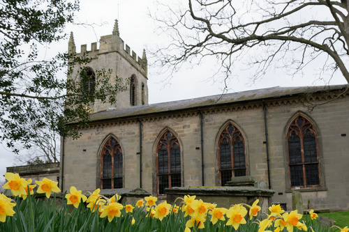

# Name: St Alkmund, Whitchurch
- Date: 1712 AD

Whitchurch is the oldest continually inhabited town in Shropshire.

Whitchurch acquired its present name after the construction of a Norman church in white Grinshill stone (replacing a wooden Saxon church), from the Middle English for "White Church".  Originally a Roman settlement it was half way between Wroxeter and Chester and so was known as Mediolanum (the place in the middle of the plain).  In the Doomsday book it was known as Westune (indicating its situation on the Western border of England).

The Norman church was extended in medieval times, but collaspsed on Sunday 31st July 1711.

The present church was built on the same site, this time of red sandstone.

- Sub-Image: 2019-10-12_12_53_36_DSC_5357_DxO.jpg

# Name: St John the Baptist, Whittington
- Date: 1747 AD

The medieval church associated with the castle is long gone and was replaced in the 18th Century by the present building.  The tower was built in 1747 and the nave followed in 1804.  Further changes to the building were made in 1894.

Whittington was once a place of some importance.  The Welsh form of the place name is Drefwen, which means white homestead.  The English form of the name, Wittone, also means white homestead.

# Name: St Peter, Wrockwardine
- Date: 12th Century AD

The church is mentioned in the Domesday book and so is thought to be of Saxon origin.  The current church is of Norman origin (with modifiications being made in the 14th Century).  The plan of the church forms a cruciform with the tower at the cross point, a less common layout (when compared with the more usual configuration of siting the tower at the east or west end of the building).

The name Wrockwardine is derived from the words meaning "enclosure or settlement by the Wrekin" - Wrekin is the British name for Wroxeter (and is the name given to the nearby hill).

# Name: St Andrew, Wroxeter
- Date: 12th Century AD

This church is likely more steeped in history than any other in Shropshire.

Masonry from the Roman fort of Viroconium was plundered for the construction of the church.

# Name: Holy Trinity, Yockleton
- Date: 1861 AD

Yockleton became a parish in it's own right in the 19th Century, and those who lived in Yockleton and the surrounding areas decided to build their own Church.  The land on which the Church stands was donated by Col. Wingfield of Onslow, a local landowner.

The Church is built of grey Alberbury stone with insets of pink Grinshill and pale Cardeston stone.

- Sub-Image: 2020-03-14_12_35_10_DSC_6767_DxO.jpg
- Sub-Image: 2020-03-14_12_36_30_DSC_6768_DxO.jpg
- Sub-Image: 2020-03-14_12_37_11_DSC_6770_DxO.jpg
- Sub-Image: 2020-03-14_12_37_26_DSC_6771_DxO.jpg
- Sub-Image: 2020-03-14_12_40_19_DSC_6775_DxO.jpg
