# Name: Shropshire - General View 1

A view when driving from Clun to Hopton Castle.

# Name: Caer Caradoc

TBD
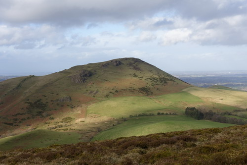

# Name: View from Flouder's Folly, Callow Hill

TBD
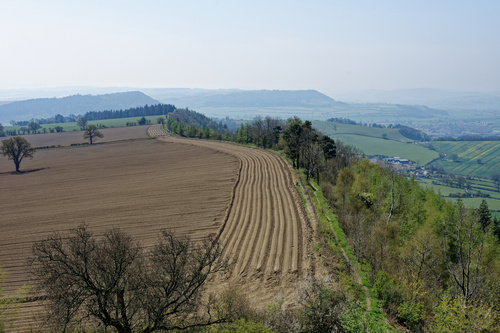

# Name: View from Flouder's Folly, Callow Hill

TBD
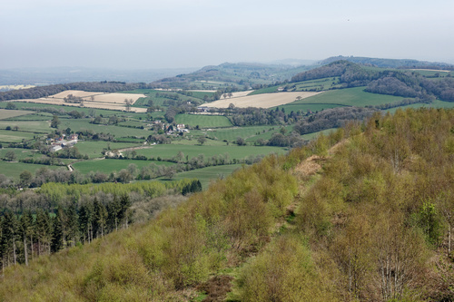

# Name: Flouder's Folly and Callow Hill

TBD
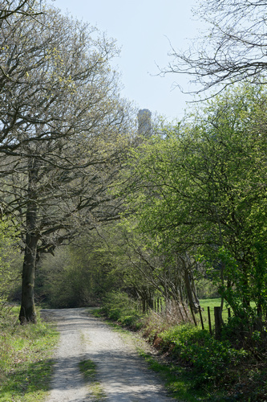

# Name: The Hollies

The Hollies nature reserve (at The Stiperstones above Snailbeach).  The reserve is a scattered grove of ancient holly trees, some of the trees are 300 or 400 years old.

Rowan trees can also be seen growing next to the holly trees, in some cases the rowan trees are rooted inside the holly trees.  This is because birds such as redwings, fieldfares and winter thrushes eat the rowan berries and then deposit the seeds when perched on the holly trees.
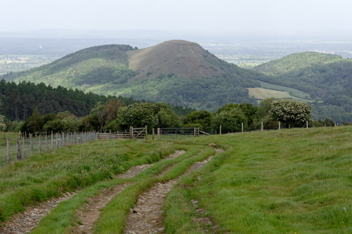

# Name: The Hollies

TBD
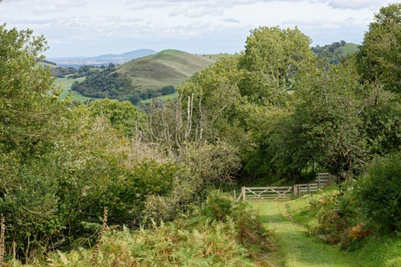

# Name: The Hollies

TBD
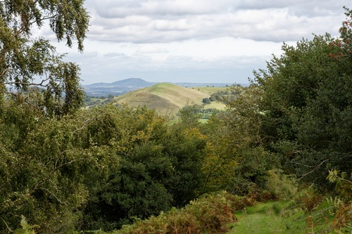

# Name: The Gaer Stone, Hope Bowdler Hill

TBD
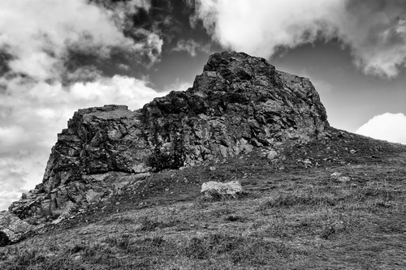

# Name: Hopton Castle

A different view of Hopton Castle.
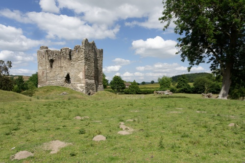

# Name: The Long Mynd

TBD
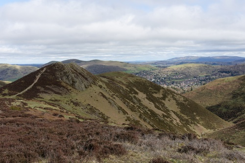

# Name: The Long Mynd

TBD
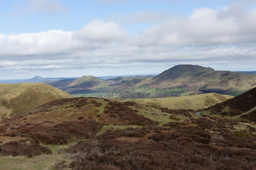

# Name: The Long Mynd

TBD
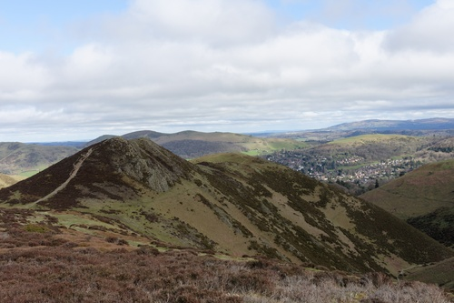

# Name: The Long Mynd

TBD
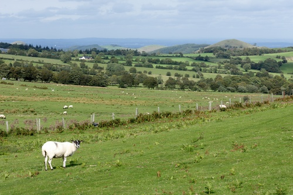

# Name: The Long Mynd

TBD
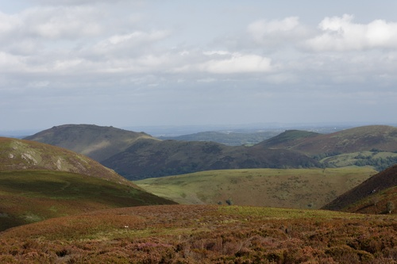

# Name: The Long Mynd

TBD
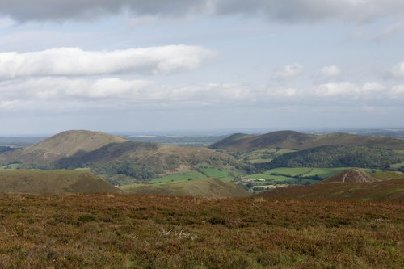

# Name: The Long Mynd

TBD
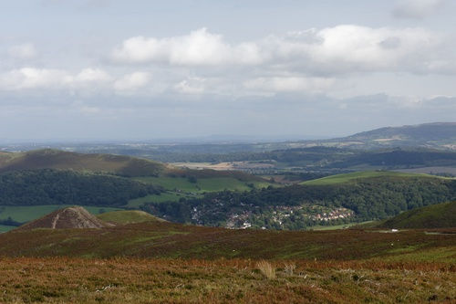

# Name: The Long Mynd

TBD
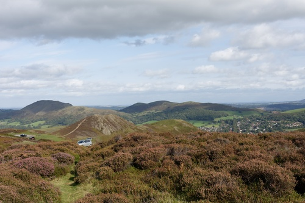

# Name: The Long Mynd

TBD
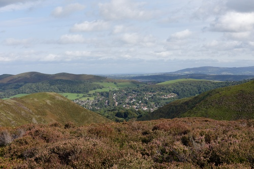

# Name: The Long Mynd

TBD
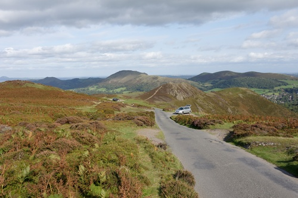

# Name: The Long Mynd

TBD
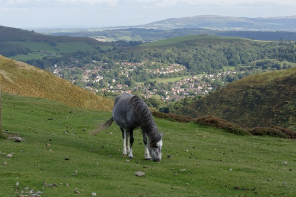

# Name: The Long Mynd

TBD
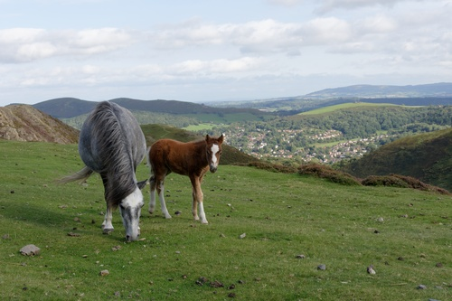

# Name: The Long Mynd

TBD
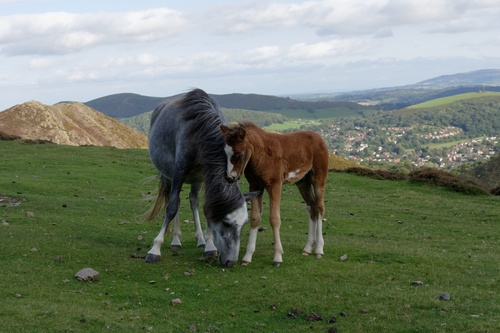

# Name: The Long Mynd

View of Church Stretton.
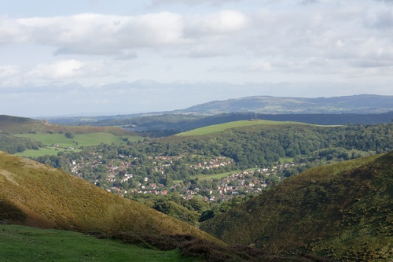

# Name: The Long Mynd

TBD
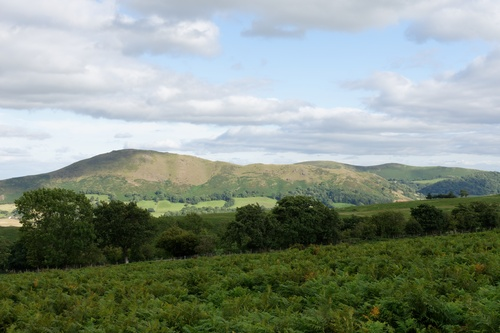

# Name: The Long Mynd

TBD
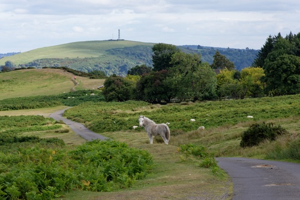

# Name: The Long Mynd

TBD
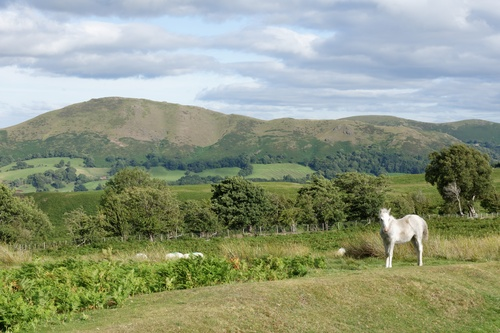

# Name: The Long Mynd

View of the Stiperstone ridge from Pole Bank.
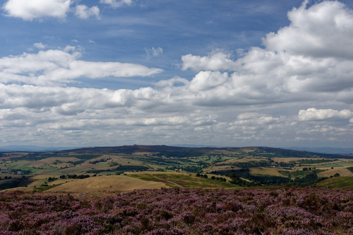

# Name: The Long Mynd

TBD
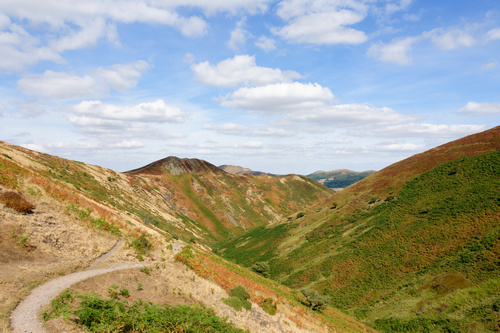

# Name: The Long Mynd

TBD
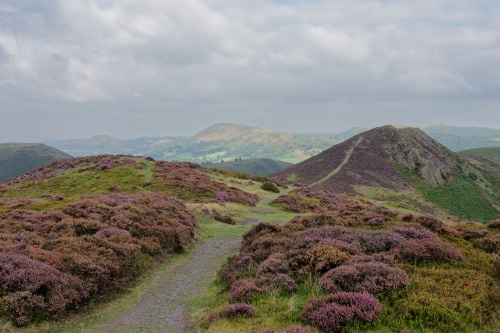

# Name: Ashes Hollow, The Long Mynd

TBD
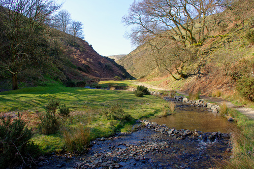

# Name: View of Caer Caradoc and Church Stretton from Small Batch, The Long Mynd

TBD
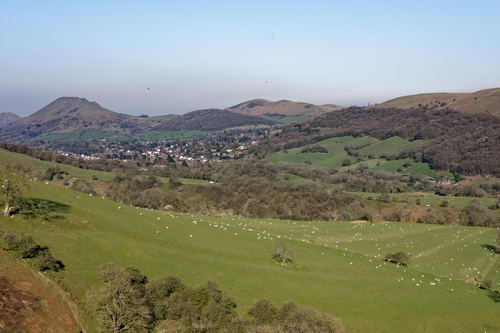

# Name: View of Caer Caradoc and Church Stretton from Small Batch, The Long Mynd

TBD
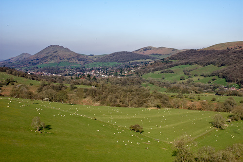

# Name: View of Ragleth Hill and Little Stretton from Small Batch, The Long Mynd

TBD
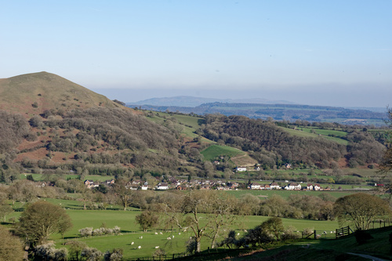

# Name: View of Whitcliffe Common and the castle from the top of St Laurence's tower, Ludlow

TBD
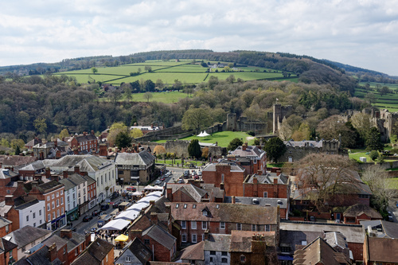

# Name: The River Teme

The River Teme as seen from Offa's Dyke near Knighton.
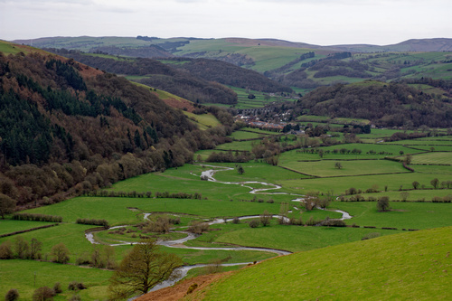

# Name: The Stiperstones

View walking down from Blakemoorgate to Snailbeach.
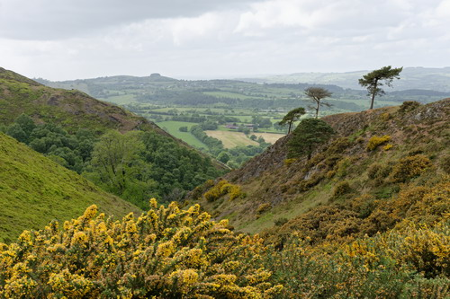

# Name: The Stiperstones

View walking down from Blakemoorgate to Snailbeach.
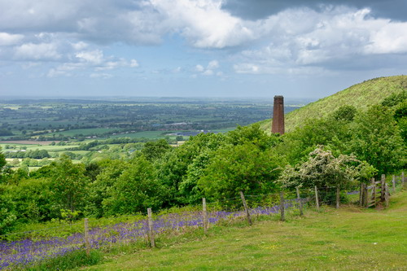

# Name: The Stiperstones - Nipstone Rock

TBD
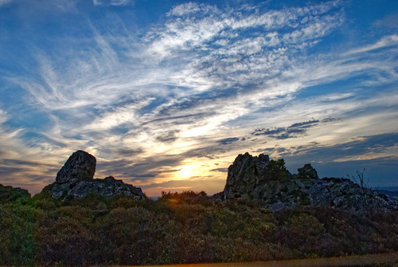

# Name: The Stiperstones

TBD
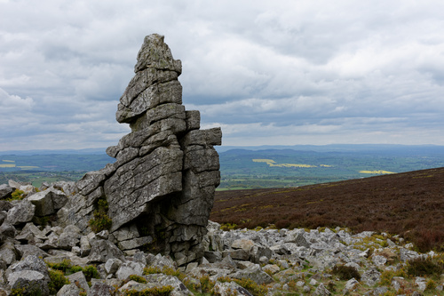

# Name: The Stiperstones

TBD
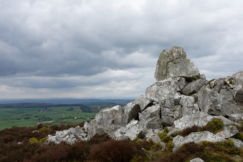

# Name: The Stiperstones

TBD
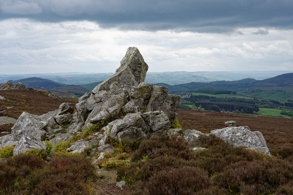

# Name: View from the Stiperstones

TBD
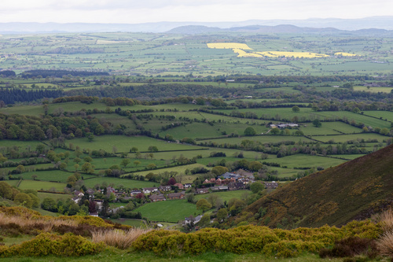

# Name: The Stiperstones

TBD
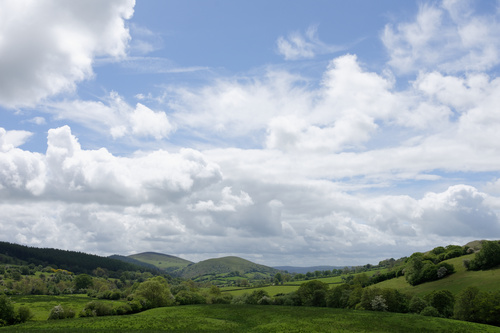

# Name: The Stiperstones

TBD
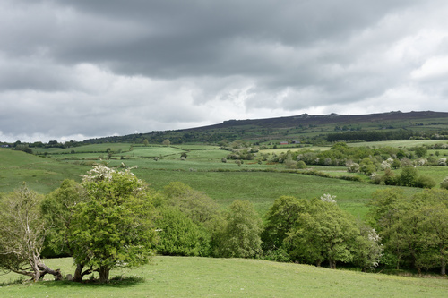

# Name: The Stiperstones

TBD
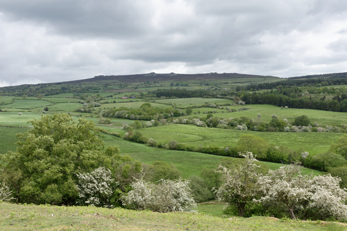

# Name: The Stiperstones

TBD
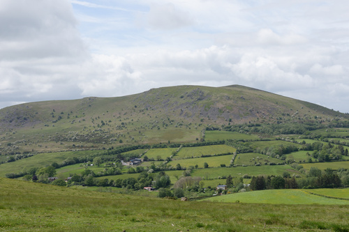

# Name: The Stiperstones

TBD
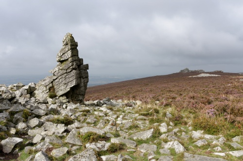

# Name: The Stiperstones

TBD
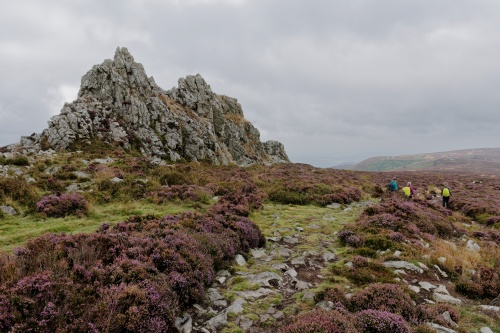

# Name: The Stiperstones

TBD
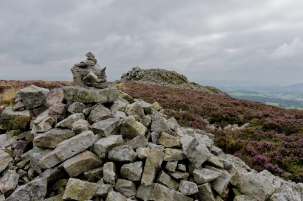

# Name: The Stiperstones

TBD
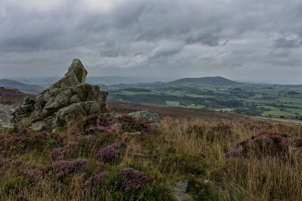

# Name: The Stiperstones

TBD

# Name: The Stiperstones

TBD

# Name: The Stiperstones

TBD

# Name: The Stiperstones

TBD

# Name: The Stiperstones

TBD

# Name: The Stiperstones

TBD

# Name: The Stiperstones

TBD

# Name: The Battle Stones, Willstone Hill

TBD

# Name: The Wrekin

At sunrise.

# Name: The Wrekin

At sunrise.

# Name: The Wrekin

At sunrise.

# Name: The Wrekin

At sunrise.

# Name: The Wrekin

At sunrise.

# Name: The Wrekin

TBD

# Name: The Wrekin

The Wrekin rises to a height of 1,335ft above the Shropshire plain.

# Name: The Wrekin

There is an Iron Age hill fort on the summit almost 8 ha (20 acres) in size.

# Name: The Wrekin

The Wrekin is the subject of a well-known legend in Shropshire folklore concerning a giant called Gwendol Wrekin ap Shenkin ap Mynyddmawr with a grudge against the town of Shrewsbury.

# Name: The Wrekin

View of the Wrekin from the road bridge over the River Severn at Cressage.

