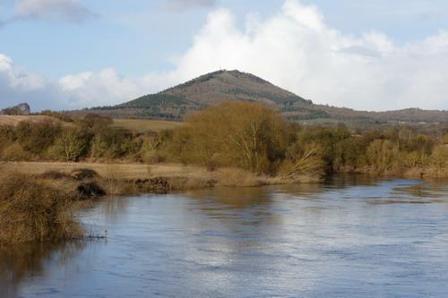

<!--Type: Item-->
# Name: The Wrekin

The Wrekin rises to a height of 1,335ft above the Shropshire plain.

<!--Type: Item-->
# Name: The Wrekin

There is an Iron Age hill fort on the summit almost 8 ha (20 acres) in size.

<!--Type: Item-->
# Name: The Wrekin

The Wrekin is the subject of a well-known legend in Shropshire folklore concerning a giant called Gwendol Wrekin ap Shenkin ap Mynyddmawr with a grudge against the town of Shrewsbury.

<!--Type: Item-->
# Name: The Wrekin

View of the Wrekin from the road bridge over the River Severn at Cressage.

<!--Type: Item-->
# Name: The Long Mynd

View of the Stiperstone ridge from Pole Bank.

<!--Type: Item-->
# Name: The Long Mynd

TBD

<!--Type: Item-->
# Name: The Stiperstones - Nipstone Rock

TBD

<!--Type: Item-->
# Name: River Teme

The River Teme as seen from Offa's Dyke near Knighton.

<!--Type: Item-->
# Name: Ashes Hollow, The Long Mynd

TBD

<!--Type: Item-->
# Name: View of Caer Caradoc and Church Stretton from Small Batch, The Long Mynd

TBD

<!--Type: Item-->
# Name: View of Caer Caradoc and Church Stretton from Small Batch, The Long Mynd

TBD

<!--Type: Item-->
# Name: View of Ragleth Hill and Little Stretton from Small Batch, The Long Mynd

TBD

<!--Type: Item-->
# Name: View of Whitcliffe Common and the castle from the top of St Laurence's tower, Ludlow

TBD

<!--Type: Item-->
# Name: The Stiperstones

TBD

<!--Type: Item-->
# Name: The Stiperstones

TBD

<!--Type: Item-->
# Name: The Stiperstones

TBD

<!--Type: Item-->
# Name: View from the Stiperstones

TBD

<!--Type: Item-->
# Name: View from Flouder's Folly, Callow Hill

TBD

<!--Type: Item-->
# Name: View from Flouder's Folly, Callow Hill

TBD

<!--Type: Item-->
# Name: Flouder's Folly and Callow Hill

TBD

<!--Type: Item-->
# Name: The Stiperstones

TBD

<!--Type: Item-->
# Name: The Stiperstones

TBD

<!--Type: Item-->
# Name: The Stiperstones

TBD

<!--Type: Item-->
# Name: The Stiperstones

TBD

<!--Type: Item-->
# Name: The Battle Stones, Willstone Hill

TBD

<!--Type: Item-->
# Name: Caer Caradoc

TBD

<!--Type: Item-->
# Name: The Gaer Stone, Hope Bowdler Hill

TBD

