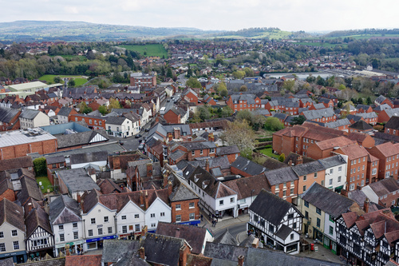
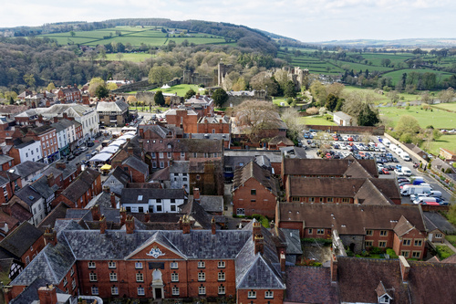
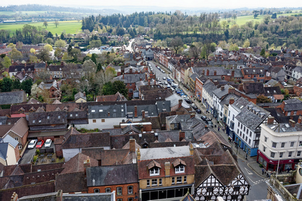
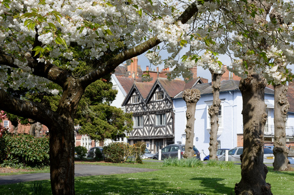
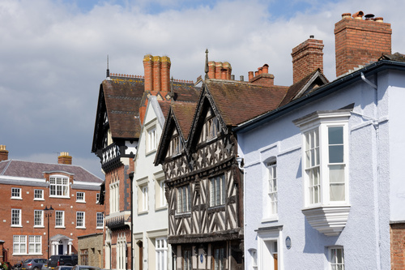
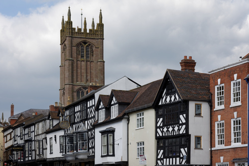
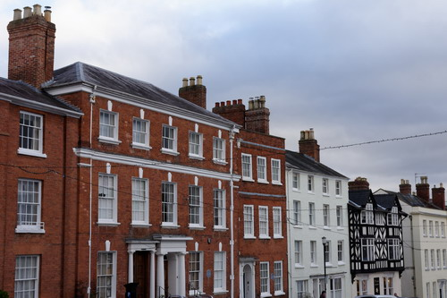
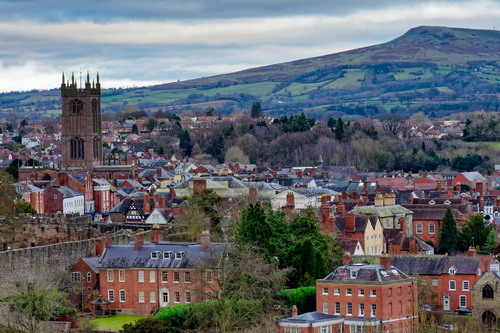
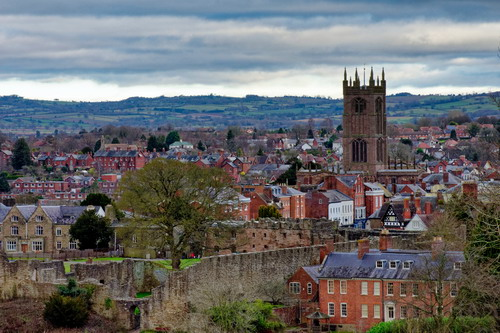
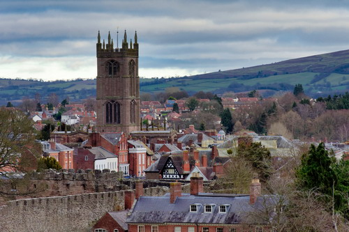

# Name: Ludlow

View of the town from the top of the church tower (St Laurence).  The tower is 135 feet (41 metres) high and the climb is 200 steps.

# Name: Ludlow

View of the town, the castle and Whitcliffe Common from the top of the church tower (St Laurence).

# Name: Ludlow

View of Broad Street from the top of the church tower (St Laurence).

# Name: Ludlow

Dinham

# Name: Ludlow

Dinham

# Name: Ludlow

Broad Street

# Name: Ludlow

Broad Street

# Name: Ludlow

View of the town from Whitcliffe Common.

# Name: Ludlow

View of the town from Whitcliffe Common.

# Name: Ludlow

View of the town from Whitcliffe Common.

