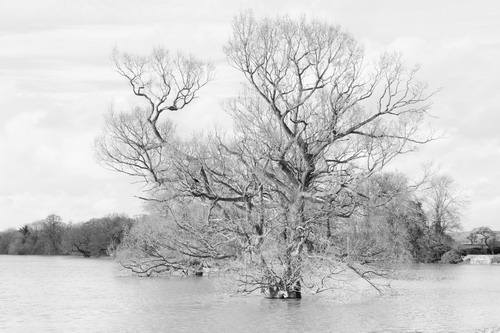
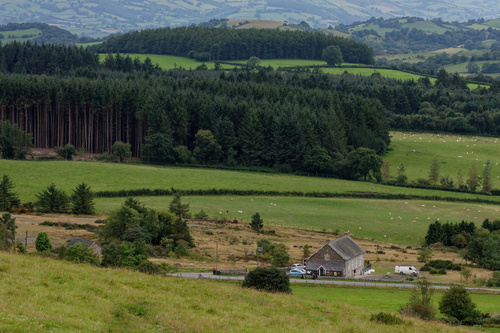
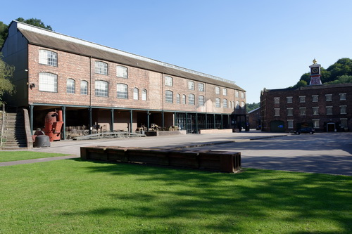
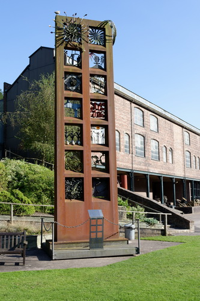
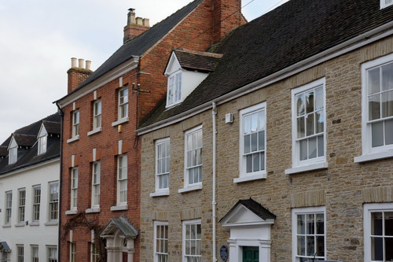
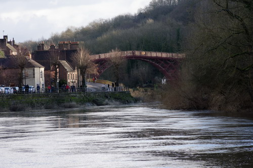
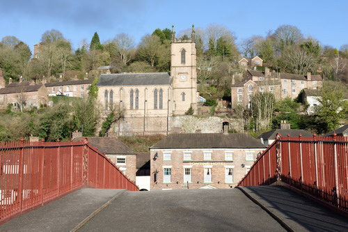
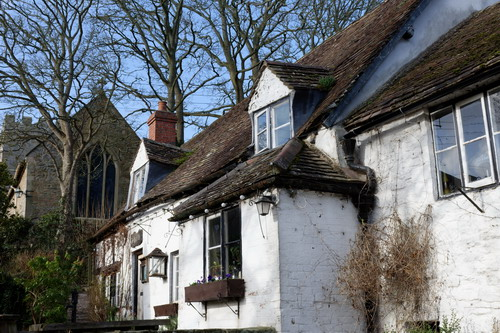

<!--Type: Item-->
# Name: Apley Woods

Apley Woods is a 19th Century landscaped 56 acre woodland near Telford.

<!--Type: Item-->
# Name: Apley Woods

Apley Woods is a 19th Century landscaped 56 acre woodland near Telford.

<!--Type: Item-->
# Name: Apley Woods

This sculpture called "Energy Rising" is located in the heart of the woodland.

It is believed to symbolise lava emerging from the earth.

<!--Type: Item-->
# Name: Cressage - Flooded Fields

In the late Winter / early Spring of 2020 there was severe flooding in Shropshire - this picture shows the flooding (River Severn at Cressage).

<!--Type: Item-->
# Name: Attingham Park - Flooded Parkland

In the late Winter / early Spring of 2020 there was severe flooding in Shropshire - this picture shows the parkland at Attingham Park.

<!--Type: Item-->
# Name: Atcham - Tree in Flood Water

In the late Winter / early Spring of 2020 there was severe flooding in Shropshire - this picture shows a tree in the flood water at Atcham.

<!--Type: Item-->
# Name: Sabrina

Hafren is the Welsh Goddess of the river Severn (Latin name is Sabrina).

The pleasure craft called Sabrina provides boat trips in Shrewsbury from the Victoria Quays round the Severn loop to the English bridge and back.

<!--Type: Item-->
# Name: The Bog Centre

The Bog Visitor Centre is located in the shadow of the Stiperstones.  It is the former Victorian school and is one of the few remaining buildings of a lost lead and barytes mining village.

<!--Type: Item-->
# Name: The Yew Tree, Hope Bagot

An ancient yew tree, thought to be between 1000 and 2000 years old.

<!--Type: Item-->
# Name: Wem Sweet Pea Festival

The Eckford Sweet Pea Society of Wem held a festival each July from 1989 to 2019.  The show was held in celebration of Henry Eckford - Eckford was a Scottish horticulturist and reputedly the most famous breeder of sweet peas.  In 1888 he moved to Wem and it was in Wem that he perfected the breeding of his Grandiflora sweet peas.  He is buried at the Whitchurch Road Cemetery in Wem.

<!--Type: Item-->
# Name: Stone Cross, Bitterley

Dating from the 14th Century, a stone cross in the churchyard of St Mary's church at Bitterley.  This one is thought to be the finest surviving stone cross in the county.

<!--Type: Item-->
# Name: Coalbrookdale

TBD

<!--Type: Item-->
# Name: Coalbrookdale

TBD

<!--Type: Item-->
# Name: Coalbrookdale

TBD

<!--Type: Item-->
# Name: Coalbrookdale

TBD

<!--Type: Item-->
# Name: Coalbrookdale

TBD

<!--Type: Item-->
# Name: Coalbrookdale

TBD

<!--Type: Item-->
# Name: Grave of Little Nell

The reputed grave of Little Nell, the character in the Charles Dickens novel The Old Curiosity Shop - in 1910 the verger created a false entry in the parish register to state that Nell Gwyn was buried at Tong.  Although fake and a grave for a fictional character, the stunt attracted many visitors.

<!--Type: Item-->
# Name: Grave of Ebenezer Scrooge

Shrewsbury was used for filiming the 1984 version of A Christmas Carol (Shrewsbury was one of Dickens's favourite places).

The grave of Ebenezer Scrooge is still in the graveyard of St Chad's.

<!--Type: Item-->
# Name: 2 King St, Ludlow

This address was used as the headquarters of Newsfield Ltd from 1984 to 1989.

Newsfield Ltd published two of the most influential video games magazines of that era - Crash and Zzap!64 for the ZX Spectrum and Comodore 64 respectively. 

<!--Type: Item-->
# Name: 4 Brand Ln, Ludlow

Mary Edwards, thought to be the first female computer, lived and worked at this address.  Paid directly by the Board of Longitude and working to the Astronomer Royal, Edwards calculated the position of the sun, moon and planets at different times of day for annual nautical almanacs used for navigation at sea.

Edwards did this from 1773 to her death in 1815.

<!--Type: Item-->
# Name: Dinham House, Ludlow

Lucien Boneparte (brother of Napoleon) was held as a prisoner of war at Dinham House for a few months in 1811 while the war between Britain and France was ongoing.

<!--Type: Item-->
# Name: Stone Cross, Ightfield

A preaching cross in the churchyard - the present shaft and cross is probably Victorian (most likley installed when the church's chancel was rebuilt in 1865).  The base most likely dates from Saxon times.

<!--Type: Item-->
# Name: Ironbridge

TBD

<!--Type: Item-->
# Name: Ironbridge

TBD

<!--Type: Item-->
# Name: Ironbridge

TBD

<!--Type: Item-->
# Name: Cardington, The Royal Oak

A free house since circa the 15th Century, the Royal Oak is reputed to be the oldest continuously licensed pub in Shropshire.

<!--Type: Item-->
# Name: Cardington, Telephone Box

The old telephone box has been adopted by the village and now contains information panels about the history of the Shropshire and the village itself.

