# Name: Stone Cross, Alberbury

Situated by the church at Alberbury, a medieval churchyard cross (most likely 15th Century) which has been converted into a sundial, probably in the 17th Century.
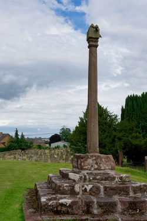

# Name: Tree in Flood Water, Atcham

In the late Winter / early Spring of 2020 there was severe flooding in Shropshire - this picture shows a tree in the flood water at Atcham.
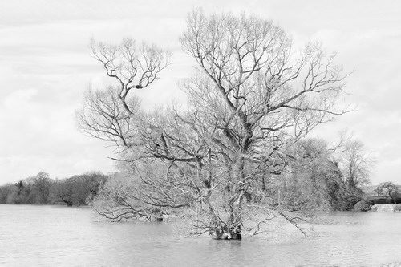

# Name: Flooded Parkland, Attingham Park

In the late Winter / early Spring of 2020 there was severe flooding in Shropshire - this picture shows the parkland at Attingham Park.
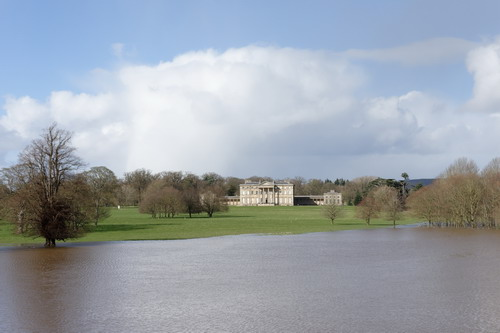

# Name: Yew Tree, Baschurch

The yew tree in the churchyard at Baschurch is hollow inside.  It is thought to date from the 6th Century.
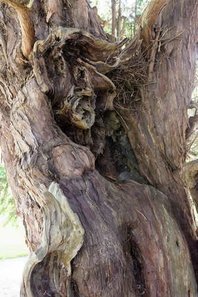

# Name: The Gargoyles on the Church, Battlefield

The Gargoyles on the church at Battlefield.
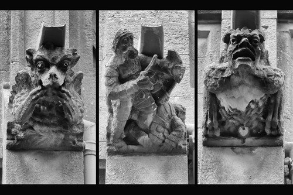

# Name: Bishop's Castle

View of Bishop's Castle from the church.
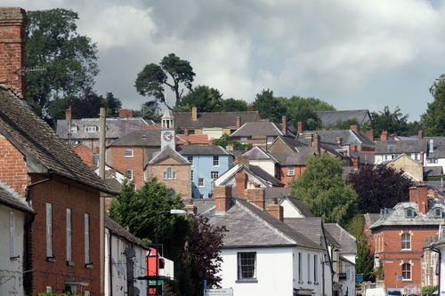

# Name: Bishop's Castle

TBD

# Name: Stone Cross, Bitterley

Dating from the 14th Century, a stone cross in the churchyard of St Mary's church at Bitterley.  This one is thought to be the finest surviving stone cross in the county.
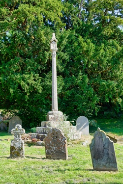

# Name: Blakemoorgate Cottages

Blakemoorgate Cottages are a pair of restored miners' cottages on The Stiperstones above Snailbeach.  They are small squatter cottages built by the miners themselves who were allowed to stay, it is said, if they could build the chimney overnight and have smoke coming out of it by morning.  The building of the rest of the cottage could follow in slower time, a small rent was then paid to the estate.
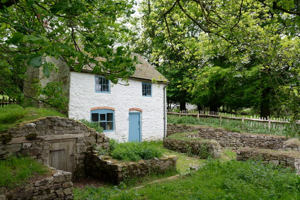

# Name: Blakemoorgate Cottages

Blakemoorgate Cottages are a pair of restored miners' cottages on The Stiperstones above Snailbeach.  It is quite a walk up to these cottage from the mine and other facilities like the church at Snailbeach.
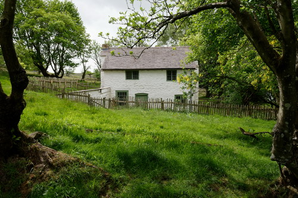

# Name: The Railway, Broseley

Broseley developed as an industrial area due to the abundance of coal, clay, iron ore and limestone easily workable in one area, also the woods provided charcoal and the River Severn transport.  In fact, the mines in Broseley and the adjoining parish of Benthall became of national importance in the seventeenth century.

This industrialisation drove innovation - a document of 1605 refers to a railway line from Birch Leasows, Broseley to the Calcutts, this is only the second railway for which evidence survives in England (making it one of the oldest railways in England).  A railway at the time would have horse drawn wagons on flanged wheels (meaning that greater loads could be moved with the same effort).
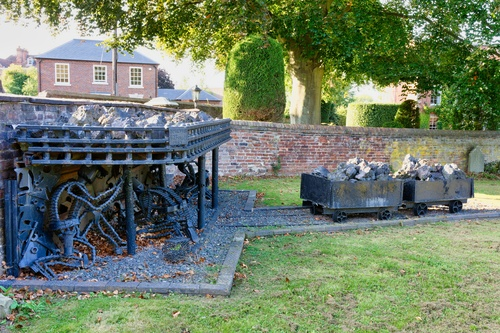

# Name: The Royal Oak, Cardington

A free house since circa the 15th Century, the Royal Oak is reputed to be the oldest continuously licensed pub in Shropshire.
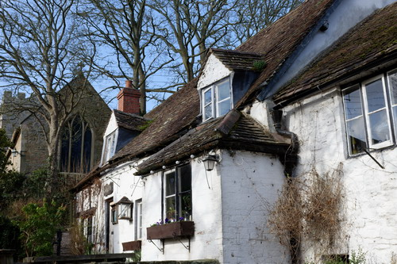

# Name: Telephone Box, Cardington

The old telephone box has been adopted by the village and now contains information panels about the history of the Shropshire and the village itself.
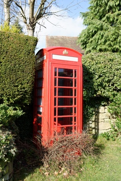

# Name: Yew Tree, Church Preen

The sign by this tree reads "This Yew is believed to have been planted approx 457AD and thought to be the oldest tree in Europe".
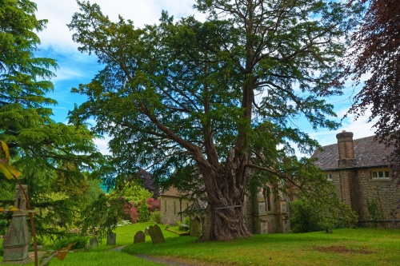

# Name: Claverley

The village of Claverley near Bridgnorth.
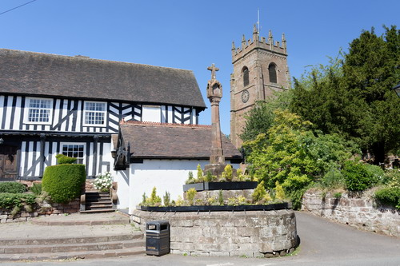

# Name: Claverley

The village of Claverley near Bridgnorth.
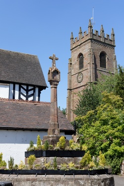

# Name: Claverley

The village of Claverley near Bridgnorth.
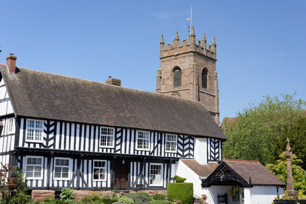

# Name: Claverley

The village of Claverley near Bridgnorth.
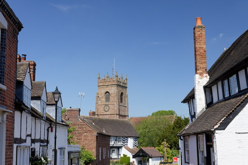

# Name: Yew Tree, Claverley

The yew tree in the churchyard at Claverley has been officially aged by botanist and television presenter Sir David Bellamy, is believed to be one of the oldest in the county at 2,500 years old.  It was trimmed in 2013 to prevent damage to the church, as the tree is listed permission had to be provided by the council.
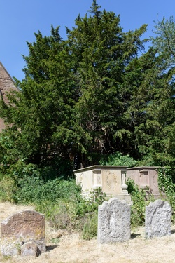

# Name: Yew Tree, Claverley

The yew tree in the churchyard at Claverley has a trunk which is hollow inside and has a circumference of more than 29ft.
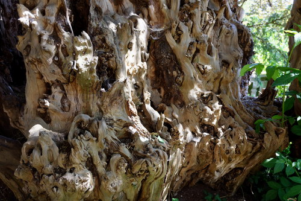

# Name: Memorial by the Church, Church Pulverbatch

The memorial reads:

In memory of 2nd Lt Arthur D Brody of Des Moines Iowa who died within sight of this spot 25th June 1944 piloting USAAF P-47 41-6231 of the 495th Fighter Training Group stationed at Atcham

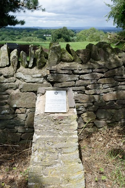

# Name: Coalbrookdale

TBD
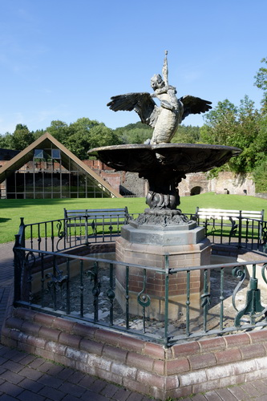

# Name: Coalbrookdale

TBD
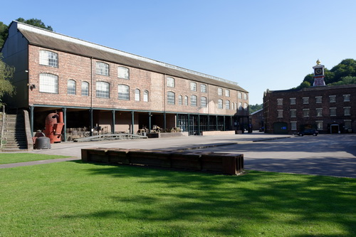

# Name: Coalbrookdale

TBD
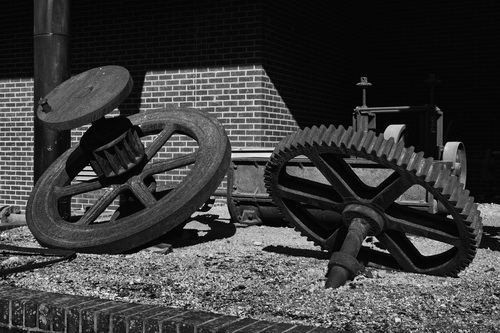

# Name: Coalbrookdale

TBD
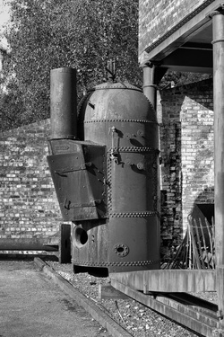

# Name: Coalbrookdale

TBD
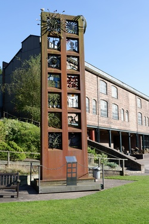

# Name: Coalbrookdale

TBD
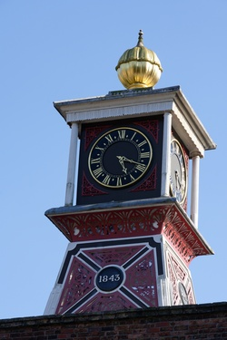

# Name: Canal Basin, Coalport

The Canal Basin at the bottom of the Hay Inclined Plane - the Coalport Canal was a short stretch of canal linking the Coalport China Works, the foot of the Inclined Plane and the River Severn.
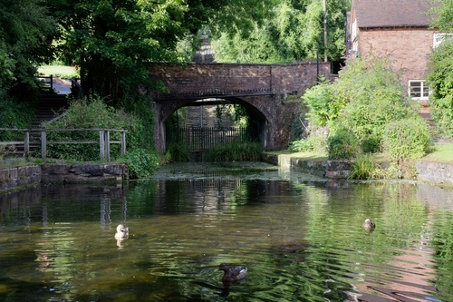

# Name: Flooded Fields, Cressage

In the late Winter / early Spring of 2020 there was severe flooding in Shropshire - this picture shows the flooding (River Severn at Cressage).
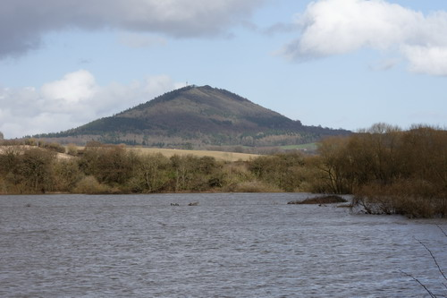

# Name: The Yew Tree, Hope Bagot

An ancient yew tree, thought to be between 1000 and 2000 years old.
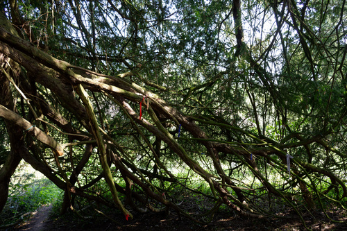

# Name: Stone Cross, Ightfield

A preaching cross in the churchyard - the present shaft and cross is probably Victorian (most likley installed when the church's chancel was rebuilt in 1865).  The base most likely dates from Saxon times.
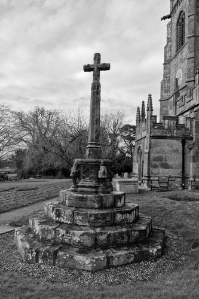

# Name: The Ironbridge at Christmas, Ironbridge

TBD
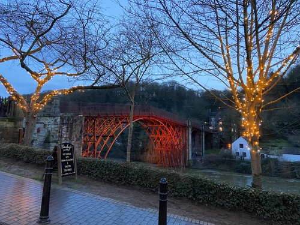

# Name: War Memorial, Ironbridge

TBD
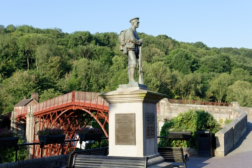

# Name: Early Morning Shadow, Ironbridge

Early morning shadows on the Iron Bridge and the Toll House.
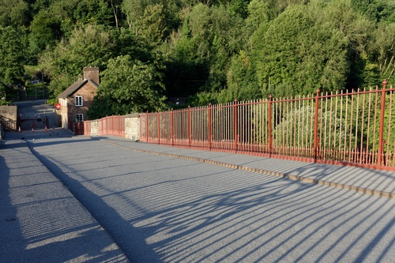

# Name: Early Morning, Ironbridge

TBD
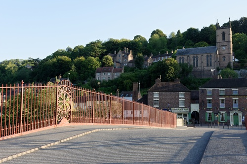

# Name: Ironbridge

TBD
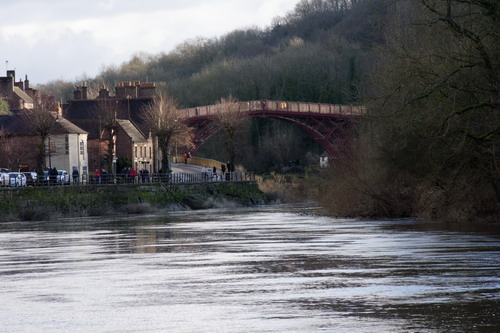

# Name: Ironbridge

TBD
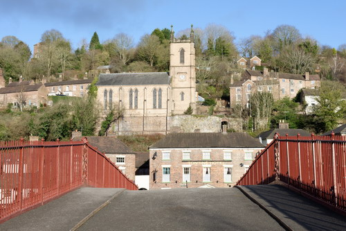

# Name: Ironbridge

TBD
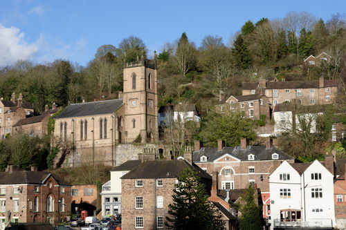

# Name: Ironbridge

TBD
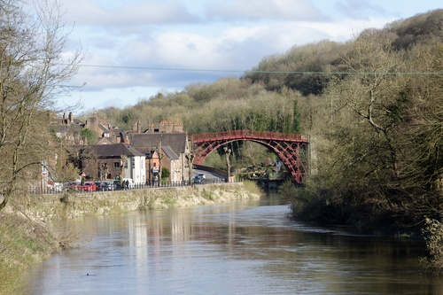

# Name: The Boat Inn, Jackfield

The Boat Inn in Jackfield keeps a record of flood levels on its door.  The highest record was set at 19 feet and six inches (5.97m) on 1st November 2000.  Other records have been set at 19 feet and five inches (5.95m) on 10th February 1946 and at 19 feet and one inch (5.8m) on 21st March 2020 and due to the Covid-19 epidemic, the inn is still undergoing repairs in August 2020, serving food and drink from a caravan.
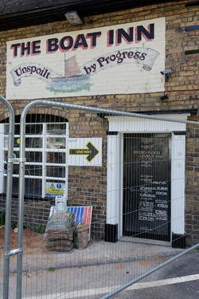

# Name: 2 King St, Ludlow

This address was used as the headquarters of Newsfield Ltd from 1984 to 1989.

Newsfield Ltd published two of the most influential video games magazines of that era - Crash and Zzap!64 for the ZX Spectrum and Comodore 64 respectively. 
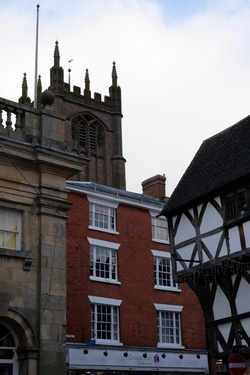

# Name: 4 Brand Ln, Ludlow

Mary Edwards, thought to be the first female computer, lived and worked at this address.  Paid directly by the Board of Longitude and working to the Astronomer Royal, Edwards calculated the position of the sun, moon and planets at different times of day for annual nautical almanacs used for navigation at sea.

Edwards did this from 1773 to her death in 1815.
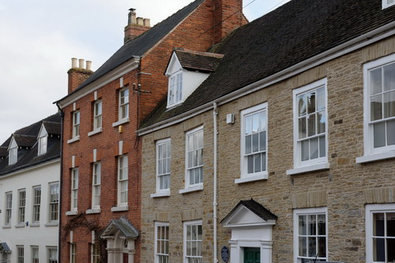

# Name: Dinham House, Ludlow

Lucien Boneparte (brother of Napoleon) was held as a prisoner of war at Dinham House for a few months in 1811 while the war between Britain and France was ongoing.
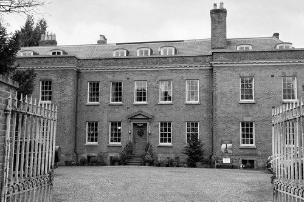

# Name: Ludford Water Mill, Ludlow

Ludford Mill is a 16th Century Water Mill (and now a private dwelling).

In front of Ludford Mill is a stepped structure.  This houses the Ludlow Hydro Co-Operative's Archimedes Screw installation.  It was completed in 2016 at a cost of £400,000 (financed by a community body supported by 170 local people and others committed to eco-friendly electricity production).  The Screw harnesses the power of the millrace to generate electricity, enough to light a bulb in every house in Ludlow and Ludford year round.

Whenever the river level is high enough, water is channelled into the top of the Screw, most of the generated electricity is fed into the National Grid.  The Screw design was chosen as it is the most wildlife friendly design.
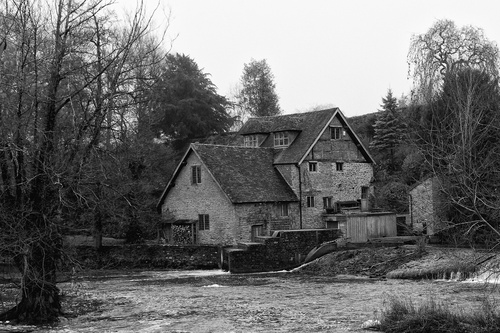

# Name: Horseshoe Weir, Ludlow

The medieval weir at Ludford Mill (River Teme, Ludlow) is Grade II listed.  There is evidence suggesting that the weir had been built by 1241 AD.  It was built to steady the flow of water to Ludford Mill.  The weir was restored in 2002.

The name Ludlow means, in Old English, loud or noisy (hlud) - referring to the River Teme - and tumulus or hill (hlaw).
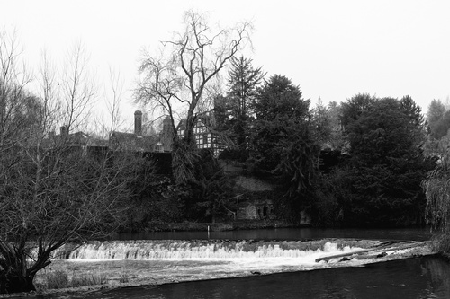

# Name: Mary Webb Memorial, Much Wenlock

Mary Webb’s formative years were spent in Much Wenlock and its people and landscape were the source of some of her literary inspiration.  In 2000, the Mary Webb Society commissioned a bronze plaque by local artist Humphrey Hallward which is sited on a piece of Wenlock stone at the rear of the Guildhall.
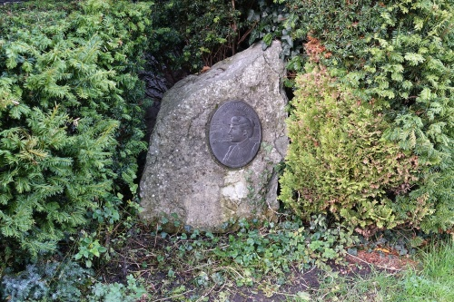

# Name: Yew Tree, Norbury

This yew tree is said to be one of the largest and one of the oldest in the UK, it has a girth of about 10m / 33ft and is estimated to be 2,700 years old.
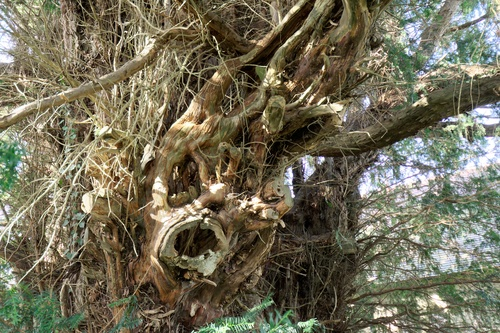

# Name: Sabrina, Shrewsbury

Hafren is the Welsh Goddess of the river Severn (Latin name is Sabrina).

The pleasure craft called Sabrina provides boat trips in Shrewsbury from the Victoria Quays round the Severn loop to the English bridge and back.
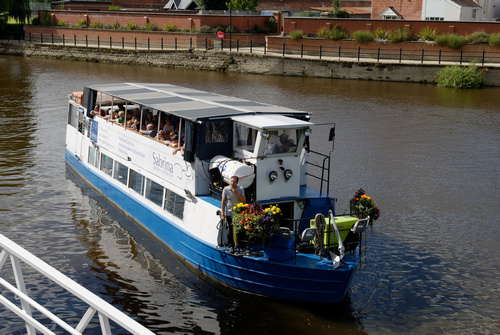

# Name: Grave of Ebenezer Scrooge, Shrewsbury

Shrewsbury was used for filiming the 1984 version of A Christmas Carol (Shrewsbury was one of Dickens's favourite places).

The grave of Ebenezer Scrooge is still in the graveyard of St Chad's.
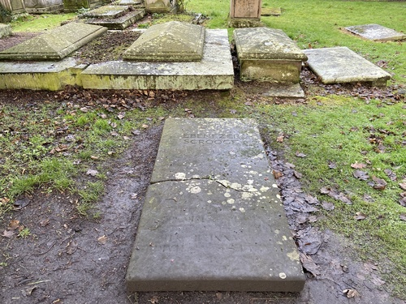

# Name: Lead Mine, Snailbeach

The entrance to Snailbeach lead mine.
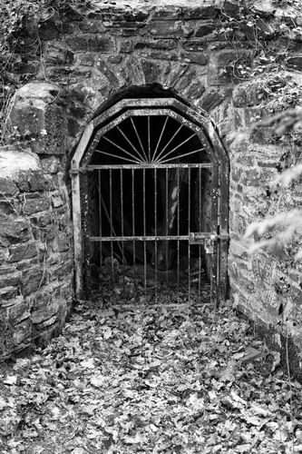

# Name: Apley Woods, Telford

Apley Woods is a 19th Century landscaped 56 acre woodland near Telford.
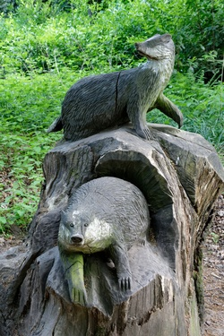

# Name: Apley Woods, Telford

Apley Woods is a 19th Century landscaped 56 acre woodland near Telford.

# Name: Apley Woods, Telford

This sculpture called "Energy Rising" is located in the heart of the woodland.

It is believed to symbolise lava emerging from the earth.

# Name: The Bog Centre

The Bog Visitor Centre is located in the shadow of the Stiperstones.  It is the former Victorian school and is one of the few remaining buildings of a lost lead and barytes mining village.

# Name: Pony, The Long Mynd

Wild ponies have lived on the Long Mynd for centuries.

# Name: Grave of Little Nell, Tong

The reputed grave of Little Nell, the character in the Charles Dickens novel The Old Curiosity Shop - in 1910 the verger created a false entry in the parish register to state that Nell Gwyn was buried at Tong.  Although fake and a grave for a fictional character, the stunt attracted many visitors.

# Name: Sweet Pea Festival, Wem

The Eckford Sweet Pea Society of Wem held a festival each July from 1989 to 2019.  The show was held in celebration of Henry Eckford - Eckford was a Scottish horticulturist and reputedly the most famous breeder of sweet peas.  In 1888 he moved to Wem and it was in Wem that he perfected the breeding of his Grandiflora sweet peas.  He is buried at the Whitchurch Road Cemetery in Wem.

