# Name: Thomas 'Old Tom' Parr Born
- Date: 1483 AD

Thomas Parr was born at the Glyn in the township of Winnington within the chapelry of Great Wollaston (in the parish of Alberbury) in 1483.

According to the plaque he lived in the reigns of ten Kings and Queens of England and died on the 13th November 1635, aged 152 years and 9 months.  He is buried in Westminster Abbey.

A modern interpretation of the results of the autopsy suggests that Parr was probably less than 70 years of age.  It is possible that Parr's records were confused with those of his grandfather.

The brass plaque is in the church at Great Wollaston.
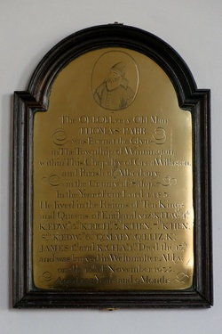

# Name: Clive of India Born
- Date: 1725 AD

Robert Clive was born at Styche, the Clive family estate, near Market Drayton in Shropshire, on 29 September 1725.
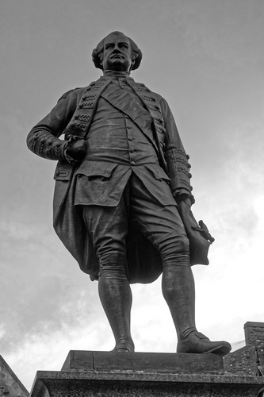

# Name: Lord Rowland Hill Born
- Date: 1772 AD

General Rowland Hill, 1st Viscount Hill, served in the Napoleonic Wars as a trusted commander under the command of the Duke of Wellington, he became Commander-in-Chief of the British Army in 1828.  Hill was also Member of Parliament for Shrewsbury from 1812 to 1814 when he was raised to his peerage.

The column is the tallest Doric column in England at 133ft 6in, it commemorates Hill with a 17ft statue - the column was built between 1814 an 1816.  Following his death in 1842, Hill bequeathed monies to the person in charge of the column.
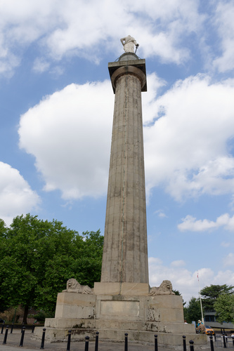

# Name: Thomas Telford arrives in the County
- Date: 1787 AD

A Scottish civil engineer, architect and stonemason, Thomas Telford, arrives in the county and is appointed Surveyor of the Public Works in Shropshire.
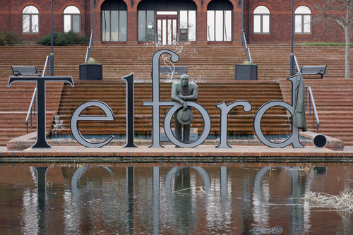

# Name: Charles Darwin Born
- Date: 1809 AD

Charles Darwin was born in Shrewsbury on 12th February at his family's home, The Mount.
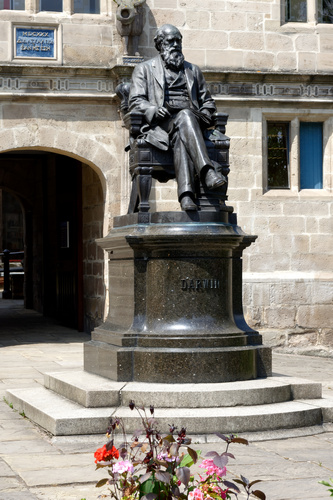

# Name: William Penny Brookes Born
- Date: 1809 AD

William Penny Brookes was an English surgeon, magistrate, botanist, and educationalist.  He established the Olympian Class of his Wenlock Agricultural Reading Society in 1850 to inspire local people to keep fit and take part in sports competitions.  Following the 1860 games, the Olympian Class was set up as the independent Wenlock Olympian Society.

Brookes' campaign for physical education brought him into contact with Baron Pierre de Coubertin - in 1890, the young French aristocrat visited Much Wenlock and stayed with Dr Brookes at his lifelong home in Wilmore Street.  Coubertin was inspired by discussions with Brookes and a games staged for his visit - in 1894 Coubertin set up the International Olympic Committee.

Consequently, Dr Brookes is credited as a founding father of the modern Olympic Games, and one of the Olympic mascots for London 2012 was named Wenlock after the town.
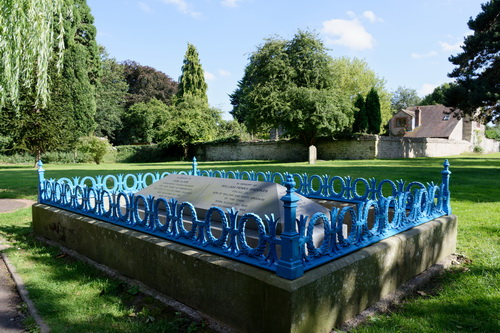

# Name: Matthew Webb Born
- Date: 1848 AD

Captain Webb was born in Dawley in 1848, he learned to swim in the River Severn at Coalbrookdale.

In 1875 he became the first recorded person to swim the English Channel without the use of artificial aids (in a time of less than 22 hours).  As a result, he became a celebrity, and performed many stunts in public.  He died trying to swim the Whirlpool Rapids below Niagara Falls, a feat which was declared impossible.  Webb was interred in Oakwood Cemetery, Niagara Falls, and in 1909 Webb's brother unveiled the memorial (drinking fountain) in Dawley.

# Name: Mary Webb Born
- Date: 1881 AD

Mary Webb was a novelist and poet whose work is set mainly in the Shropshire countryside and features Shropshire characters and people.

Webb was born in Leighton in 1881.
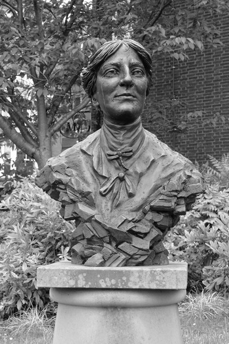

# Name: Henry Eckford arrives in Shropshire
- Date: 1888 AD

Henry Eckford was a Scottish horticulturist and reputedly the most famous breeder of sweet peas.  In 1888 he moved to Wem and it was in Wem that he perfected the breeding of his Grandiflora sweet peas.  He is buried at the Whitchurch Road Cemetery in Wem.
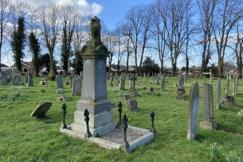

# Name: Wilfred Owen Born
- Date: 1893 AD

Owen was born on 18 March 1893 at Plas Wilmot, a house in Weston Lane, near Oswestry in Shropshire.

He was one of the leading poets of the First World War.
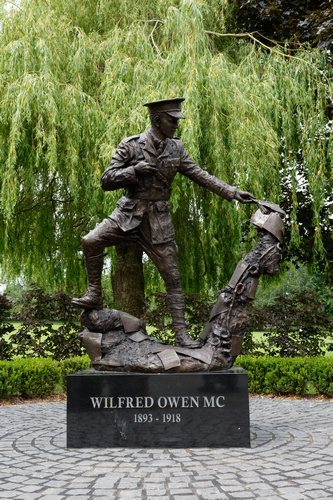

# Name: Richard Munslow Dies
- Date: 1906 AD

Richard Munslow is believed to be the last known 'sin-eater' in England.
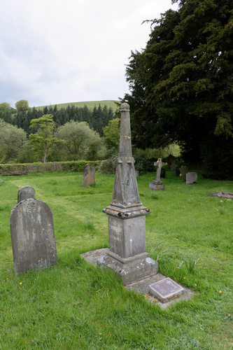

# Name: Billy Wright Born
- Date: 1924 AD

William (Billy) Wright was born at 33 Belmont Road, Ironbridge.

Wright spent his entire club career at Wolverhampton Wanderers.  He is the first footballer in the world to earn 100 international caps, Wright also holds the record for longest unbroken run in competitive international football.  He also made a total of 105 appearances for England, captaining them a record 90 times.
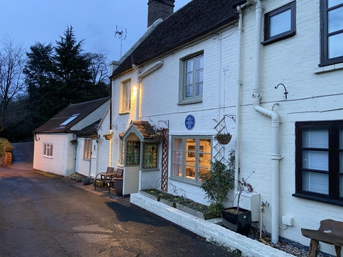

# Name: Percy Thrower Moves to Shrewsbury
- Date: 1946 AD

Percy Thrower moved to Shrewsbury in 1946, taking the position of Parks Superintendent (the youngest to take this position).  He expected to stay only four or five years, but in fact remained in post until 1974.

