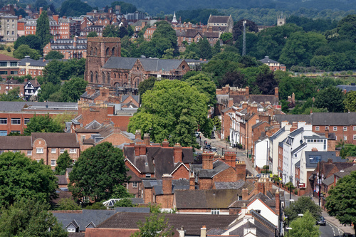
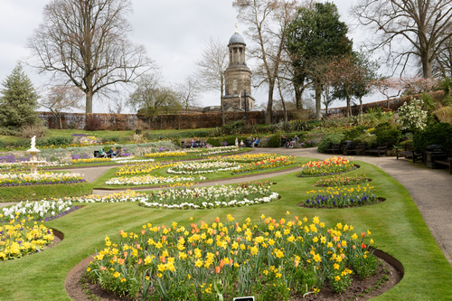
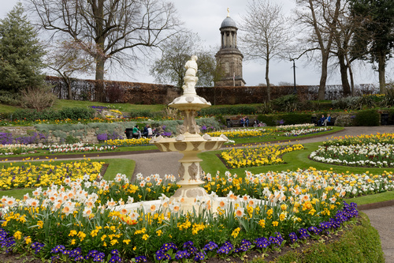
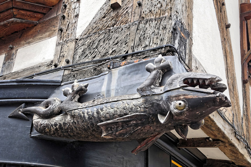
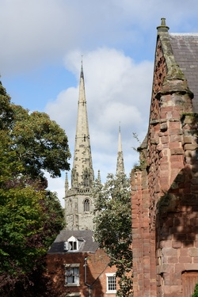
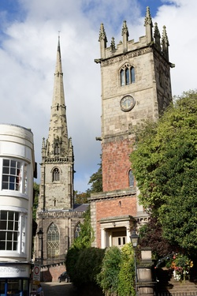
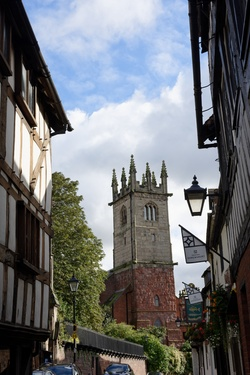
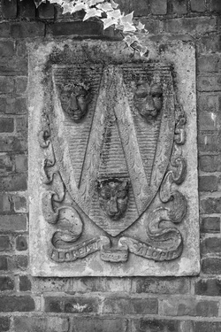

# Name: View from Lord Hill Column

View of Shrewsbury from the top of the Lord Hill column - the column is 133ft tall and there are 172 steps.

# Name: Abbey Foregate

View of Abbey Foregate and the Abbey from the top of the Lord Hill column - the column is 133ft tall and there are 172 steps.

# Name: The Dingle

TBD

# Name: The Dingle

TBD

# Name: The Mardol Dragon

Not actually part of the original building, but added in the 20th Century!

# Name: TBD

TBD

# Name: TBD

TBD

# Name: TBD

TBD

# Name: TBD

TBD

# Name: Statue of Hercules

TBD

# Name: St John's Hill

TBD

