# Name: The Old Town Hall

The Old Town Hall
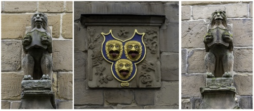

# Name: The Market Hall

The Market Hall
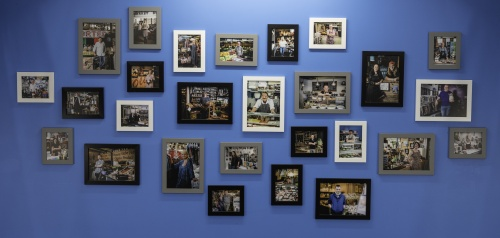

# Name: The Market Hall

The Market Hall
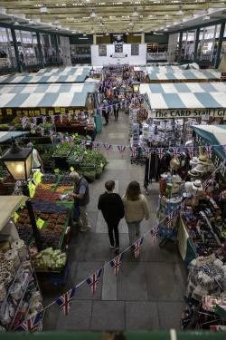

# Name: The Market Hall

The Market Hall
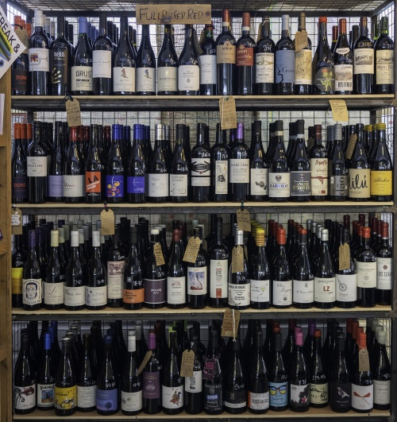

# Name: War Memorial

War Memorial
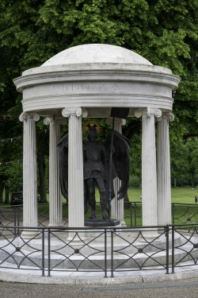

# Name: The Loopy Shrew

The Loopy Shrew
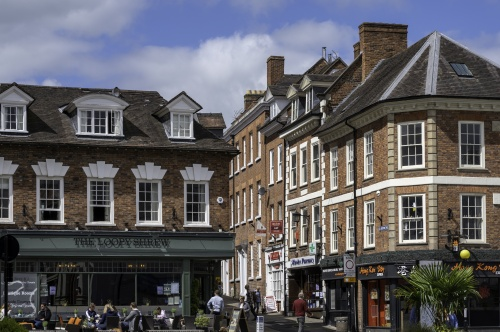

# Name: Unknown

Unknown
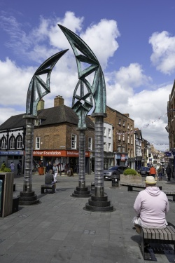

# Name: Buskers

Buskers
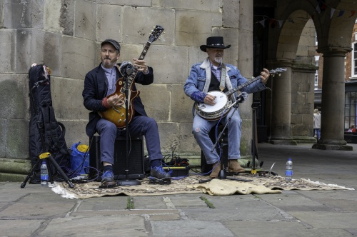

# Name: Clive of India

Clive of India
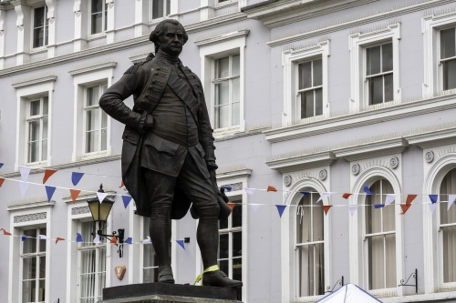

# Name: High St

High Street
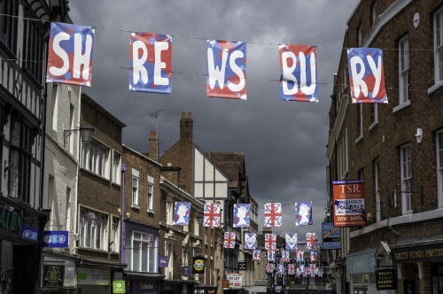

# Name: Milk St

Milk Street
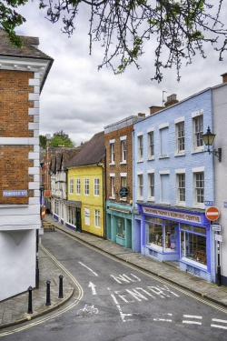

# Name: Old St Chad's Door

Old St Chad's Door
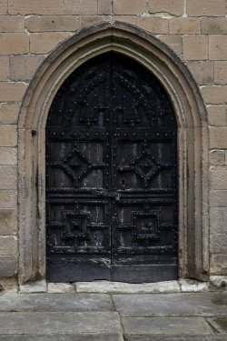

# Name: Old Market Hall

Old Market Hall
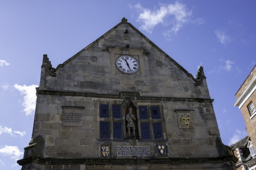

# Name: Old Market Hall

Old Market Hall
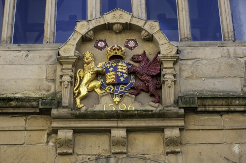

# Name: View from Lord Hill Column

View of Shrewsbury from the top of the Lord Hill column - the column is 133ft tall and there are 172 steps.

# Name: Abbey Foregate

View of Abbey Foregate and the Abbey from the top of the Lord Hill column - the column is 133ft tall and there are 172 steps.
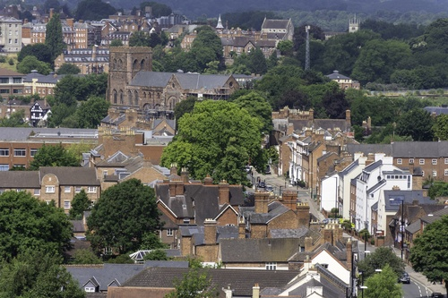

# Name: The Dingle

The Dingle
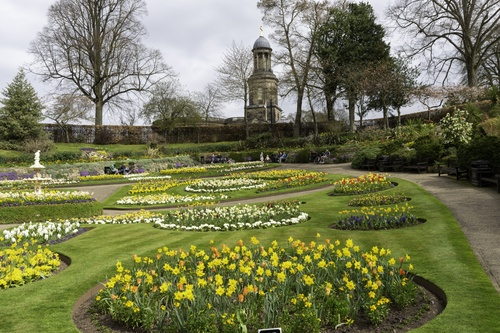

# Name: The Dingle

The Dingle
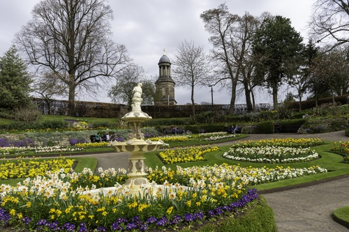

# Name: The Mardol Dragon

The Mardol Dragon - not actually part of the original building, but added in the 20th Century!

# Name: TBD

TBD
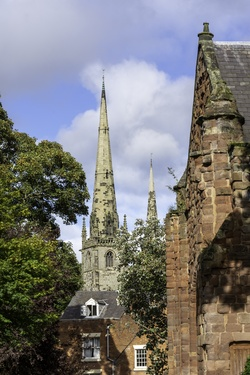

# Name: TBD

TBD
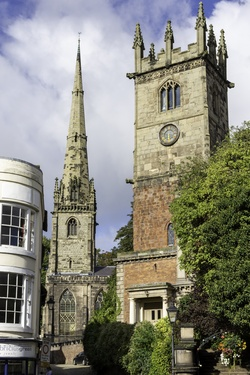

# Name: TBD

TBD
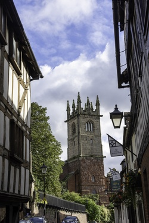

# Name: TBD

TBD
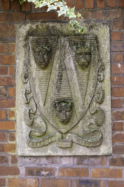

# Name: Statue of Hercules

Statue of Hercules
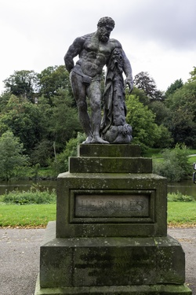

# Name: St John's Hill

St John's Hill
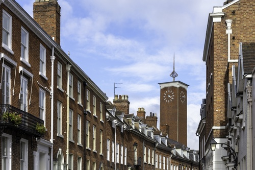
