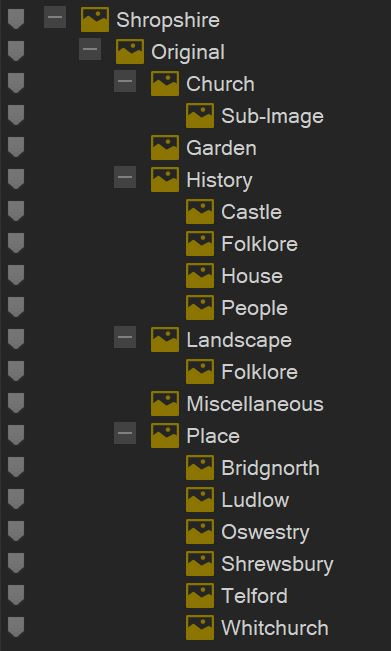
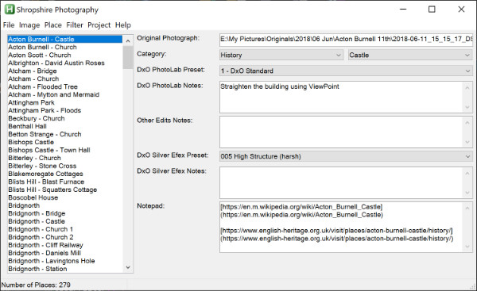
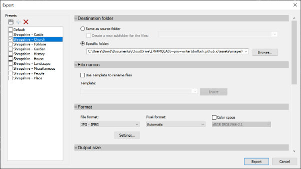

{{TOC}}
[TOC]

# Introduction
To learn more about the beautiful county of Shropshire, I use my photographs to investigate the history and explore the landscape.

My photographs are presented via a Web Site, which is organised into the following areas:

- History
- Landscape
- Castles
- Churches
- Houses
- People
- Folklore
- Places
- Gardens
- Miscellaneous

The Web Site is hosted in my GitHub repositry:

>[https://dmfbsh.github.io/](https://dmfbsh.github.io/)

It is a static site, generated using Jekyll ([https://jekyllrb.com/](https://jekyllrb.com/)) - Jekyll is Ruby based.

The Web Site is developed using Liquid templates ([https://shopify.github.io/liquid/basics/introduction/](https://shopify.github.io/liquid/basics/introduction/)) to define the presentation layout and data is contained in YAML files ([https://yaml.org/](https://yaml.org/)).  The YAML files are generated from Markdown files ([https://www.markdownguide.org/](https://www.markdownguide.org/)), this makes it easier to edit the source content.

All assets relating to the project are held in my GitHub repository, which is cloned to the iCloud Drive (to allow collaboration across all my devices) in the folder:

>C:\Users\David\Documents\iCloudDrive\27N4MQEA55\~pro\~writer

(This is the iCloud folder for the iA Writer app).

# Web Site

## Procedure to Add New Items to the Web Site

1. In ACDSee select a photo for the item

2. In ACDSee assign the selected photo to one or more categories in the Shropshire category

3. Create a folder (using the AHK Shropshire Photography application) for the item in;

>E:\My Pictures\Published\Shropshire

4. In ACDSee assign the original photo to the item (using the AHK Shropshire Photography application) - this also creates the database record

5. In DxO PhotoLab develop the photo and export to disk using the Shropshire Photography output option

6. In the AHK Shropshire Photography application record any adjustments made in DxO PhotoLab

7. Move the developed photo to the item's folder - use the Move function in the AHK Shropshire Photography application to do this

8. Edit photo as required with Affinity Photo and / or Luminar

9. In the AHK Shropshire Photography application record any adjustments made in the photo editor(s)

10. If history, create a B&W version of the photo (create a copy of the photo and suffix the filename with _bw), do this in ACDSee using the plugin DxO Silver Efex Pro

11. If history, in the AHK Shropshire Photography application record any adjustments made in DxO Silver Efex Pro

12. Generate a thumbnail for each category to which the item is assigned to - for the history page the thumbnails are 400x400 and for all other pages the thumbnails are 500x500 - thumbnails are generated using ACDSee batch export tasks

13. Add the item to the MD file for the page(s) on which it will feature

14. Record the changes made to the Web Site as a post in the blog

15. If the item is a church, change the colour on Google map

[My Maps](https://www.google.co.uk/maps/d/)

16. If the item is a church, change the colour in the GPX file for the UK Maps app

>C:\Users\David\Documents\iCloudDrive\27N4MQEA55~pro~writer\dmfbsh.github.io\_maps\Shropshire - Churches.gpx

17. Send the GPX file to the iPhone & iPad (this is done via GitHub) and load into the UK Maps app

    *Additional steps for Church sub-images:*

18. In ACDSee identify any photos for the sub-images

19. In ACDSee assign the selected photos for the sub-images to the Church > Sub-Image category

20. In DxO PhotoLab develop the photos for the sub-images and export to disk using the Shropshire Photography output option

21. Add the filenames of the sub-images to the MD file entry for the church

22. Crop and resize the sub-images to be 240px high and save in the assets\images\churches-sub folder - there is an Export preset in ACDSee for this, the oroginal DxO files can then be deleted

## Procedure to Generate the Web Site

1. Convert the MD files into the YML data files - there is a Ruby script to do this:

>C:\Users\David\Documents\iCloudDrive\27N4MQEA55\~pro\~writer\dmfbsh.github.io\_ruby\convert_md_to_yml.rb

2. Generate a YML data file of recent photos - there is a Ruby script to do this:

>C:\Users\David\Documents\iCloudDrive\27N4MQEA55\~pro\~writer\dmfbsh.github.io\_ruby\generate_recents.rb

3. Generate the local copy of the statis Web Site:

> jekyll build

4. Commit the changes to the GitHub repository (master branch) - this is done using the GitHub desktop application

## Tool Installation and Configuration

The following tools are used by the project:

- MS Windows 10
  - Ruby
  - Jekyll
  - UltraEdit
  - Typora
  - AutoHotKey
  - GitHub Desktop
  - OneNote
  - ACDSee Photo Studio Professional
  - DB Browser (SQLite)
  - Inkscape
  - Google Maps
- iOS
  - Working Copy
  - UK Map
  - OneNote

To install Ruby and Jekyll, do the following:

1. Install Ruby

- Download and install Ruby with Devkit from [https://rubyinstaller.org/downloads/](https://rubyinstaller.org/downloads/)
- Run the ***ridk install*** step on the last stage of the installation wizard

3. Install Jekyll from the command line:

- Install the gems: ***gem install jekyll bundler***
- Check the version: ***jekyll -v***

A project - Shropshire Web Site - is set up in UltraEdit to ease access to the files.

UltraEdit is installed with no specific configuration.  A project - Shropshire Web Site - has been set up to allow easy access to the files, and provide shortcuts to access the various tools and scripts.

Typora is installed with no specific configuration.

AutoHotKey (64-bit) is installed, with no additional configuration.

GitHub desktop is installed, with no additional configuration.

## AutoHotKey Script Database Application

The status of the project is maintained in an SQLite3 database.  This is access through a bespoke AutoHotKey scripted application.

AHK - 64 bit

SQLite DLL - 64 bit

## Maps

Churches map

