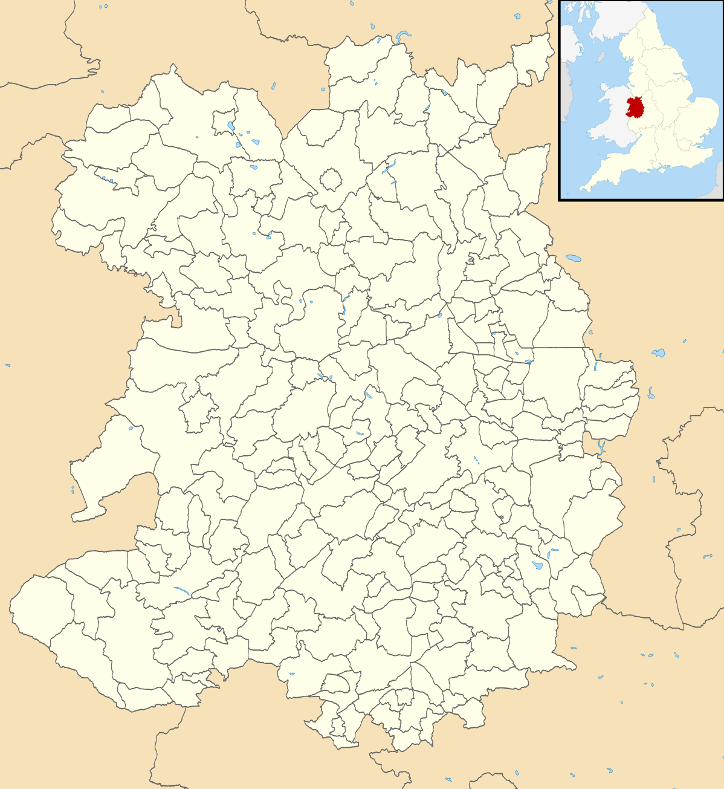

> [!QUOTE]
> 
> *"I know no greater pleasure than church crawling. You never know what you are going to find."*
> 
> Sir John Betjeman

![[2023-04-06_14_35_19_DSC_8259.jpg | 400]]

Holy Trinity, Wistanstow

# Church Crawling

The term "church crawling" was coined by the English poet Sir John Betjeman. He first used the phrase in 1948, when he spoke the words above.

The phrase describes the leisure activity of visiting historic churches and cathedrals not strictly for religious worship, but to appreciate their architecture, art, and local history.

![[2021-07-16_13_27_28_DSC_9723.jpg | 400]]

St Michael, Stanton Long

# Web Site Purpose

This web site is my "church crawl" of the Anglican churches in the county of Shropshire.

The idea is to visit as many Anglican churches as possible within the county of Shropshire.  Some churches will be open; it is accepted that some will be locked, or otherwise inaccessible when visited, and some churches simply cannot be visited for whatever reason. Also, any churches constructed in modern Britains (i.e. post-Victorian) are being excluded from the "church crawl".

Refer to the page <a href="visiting.html">Introduction to Visiting Shropshire's Churches</a> for details of how many churches there are to visit and how many have actually been visited to date.

The churches that have been visited as part of this "Church Crawl" are listed on two pages, organised by diocese - Shropshire is divided between two dioceses, Lichfield to the north and Hereford to the south. The list of churches visited in each diocese can be accessed by selecting the coat of arms of a diocese on the map below or from the menu on the left hand side of this page.

  
  
  

The information and photographs gathered during the visits in this "church crawl" are then used as the basis for a <a href="0.html">tour through the history of the Church of England with a bias to the county of Shropshire</a>.  This is organised into a series of pages covering the significant and relevent periods of English history, these pages can be accessed using the timeline below or the menu on the left hand side of this page.

<section class="experience pt-100 pb-100" id="experience">

<h4><a href="0.html">The History of the Church of England (with a bias towards Shropshire)</a></h4>

<ul class="timeline-list">

<li>

<h4><a href="1.html">Iron Age Britain</a></h4>

<i>The beginnings of Christianity in Judea...Britain is characterised by polytheistic religion with a strong connection to the natural world...</i>

</li>
<li>

<h4><a href="2.html">Roman Britain</a></h4>

<i>Christianity spreads throughout the Roman Empire and reaches Britain...it becomes the official religion of the Roman Empire and starts to organise around dioceses...the Nicene Creed is written...the role of the Bishop is created and Rome becomes the Papacy...</i>

</li>
<li>

<h4><a href="3.html">Early Medieval Britain (Dark Ages / Anglo-Saxon Britain)</a></h4>

<i>The kingdom of Mercia is established in the 6th Century AD...the Gregorian mission arrives in Britain in the same Century, but Mercia is Christianised later than the other Anglo-Saxon kingdoms...the dioceses of Lichfield and Hereford are established...</i>

</li>
<li>

<h4><a href="4.html">Norman Britain (Medieval Britain)</a></h4>

<i>Following the Norman invasion of 1066 AD, the church is reformed and reorganised to bring it into line with the continental Christian church…many abbeys and priories are established…tensions between the king and the pope prevailed…</i>

</li>
<li>

<h4><a href="5.html">The Plantagenents (Late Medieval Britain)</a></h4>

<i>The conflict between the king and pope continued…it was the age of the crusades…and life centred around the manor house and the parish church, with the church being so much more than somewhere to worship on a Sunday...</i>

</li>
<li>

<h4><a href="6.html">Tudor Britain</a></h4>

<i>Tudor Britain was defined by the English Reformation and the Dissolution of the Monasteries which was started by Henry VIII and concluded by Elizabeth I in the Elizabethan Religious Settlement, this laid the foundation for Anglicanism…</i>

</li>
<li>

<h4><a href="7.html">Stuart Britain</a></h4>

<i>A turbulent time in English history when Puritanism came to the fore...which ultimately resulted in the religious landscape assuming its present form...</i>

</li>
<li>

<h4><a href="8.html">Georgian Britain</a></h4>

<i>Although a period of relative stability for the Anglican church, there was a shift towards practical Christianity and good works...this period saw the rise of Methodism and other evangelical movements...</i>

</li>
<li>

<h4><a href="9.html">Victorian Britain</a></h4>

<i>Catholics and Nonconformists are given greater freedoms...a significant amount of church restoration and building is undertaken to provide for growing populations in the cities and other areas driven by the industrial revolution...</i>

</li>
<li>

<h4><a href="10.html">Modern Britain</a></h4>

<i>The Church of England experiences decline...the consecration of the first female bishop...trusts are established to provide funds for repairs to historic churches...the church in Wales separates causing re-alignment along the border...</i>

</li>

</ul>

</section>

## Supplementary Information

A number of appendices are available on this web site, giving some useful supplementary information and content which is intended to aid getting the most out of any "church crawl". These are:

<ul>
<li><a href="14.html">Appendix A - Hierarchical Organisation of the Church of England</a></li>
<li><a href="15.html">Appendix B - Listing on the National Heritage List for England</a></li>
<li><a href="16.html">Appendix C - Dedications of Churches</a></li>
<li><a href="17.html">Appendix D - Architectural Structure</a></li>
<li><a href="18.html">Appendix E - Features of Interest</a></li>
</ul>

# Web Site Navigation

Access the various pages of this web site using the menu on the left hand side of this page, or alternatively use the links in the content above.

![[2020-09-19_14_04_19_DSC_8624.jpg | 400]]

St Michael and All Angels, Wentmor

![[2020-12-31_13_15_37_DSC_9209.jpg | 400]]

St Bartholomew, Benthall

